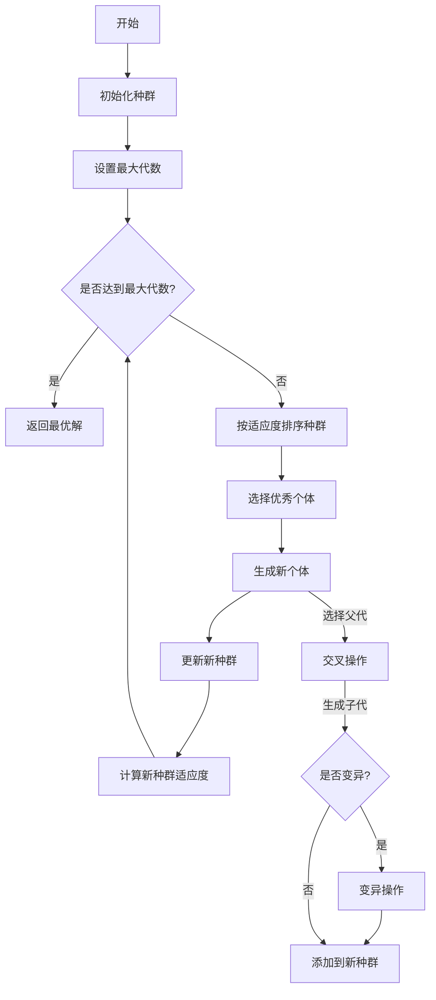
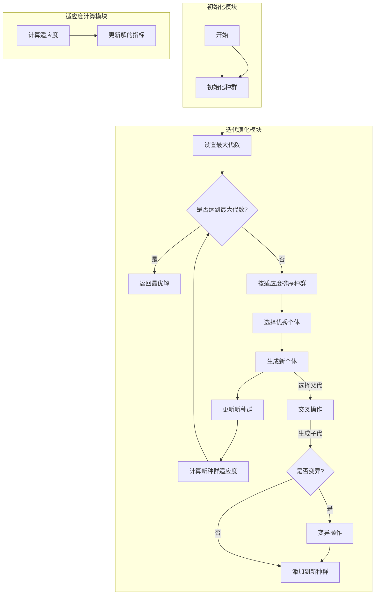

### 代码功能解释

这段Java代码实现了一个遗传算法（Genetic Algorithm, GA），用于解决优化问题。主要功能包括：

1. **初始化种群**：生成初始解集。
2. **迭代演化**：通过选择、交叉和变异操作生成新种群，直到达到最大代数。
3. **计算适应度**：评估每个解的优劣。
4. **选择最优解**：返回最终种群中适应度最高的解。

### 详细步骤

1. **初始化种群**：
    - 随机生成指定数量的解，每个解代表一个问题的可能解法。
    - 计算并更新每个解的适应度值。

2. **迭代演化**：
    - 按照适应度对当前种群进行排序。
    - 选择部分优秀个体直接进入下一代。
    - 通过选择、交叉和变异操作生成新的个体，补充到新种群中。
    - 更新新种群的适应度值。

3. **计算适应度**：
    - 根据解的路径信息计算总成本和总时间。
    - 如果总时间超过约束，增加惩罚成本。

4. **选择最优解**：
    - 在最终种群中选择适应度最低的解作为最优解。

### 控制流图

### 代码模块划分

为了更清晰地展示代码逻辑，可以将代码分为几个模块：

1. **初始化模块**：
    - `initializePopulation`：生成初始种群。

2. **迭代演化模块**：
    - `solve`：主迭代过程。
    - `selectParent`：选择父代。
    - `crossover`：交叉操作。
    - `mutate`：变异操作。

3. **适应度计算模块**：
    - `calculateFitness`：计算适应度。
    - `updateSolutionMetrics`：更新解的指标。

### 控制流图（分模块）

希望这些解释和控制流图能帮助你更好地理解这段代码的逻辑。