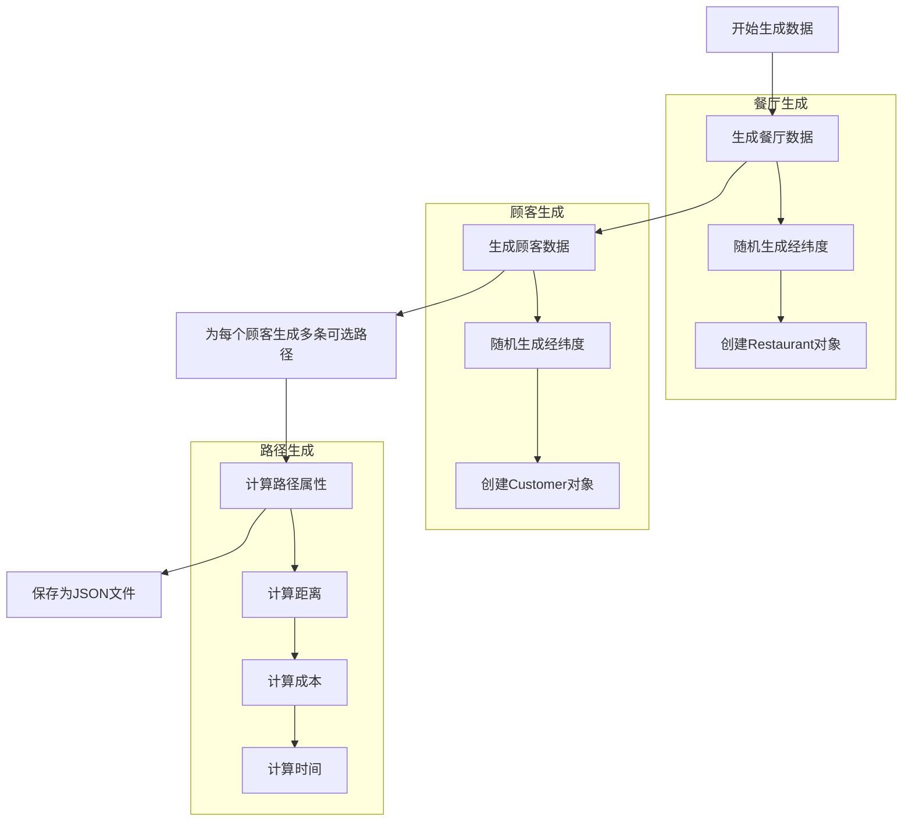
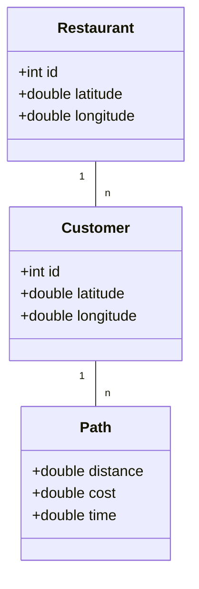
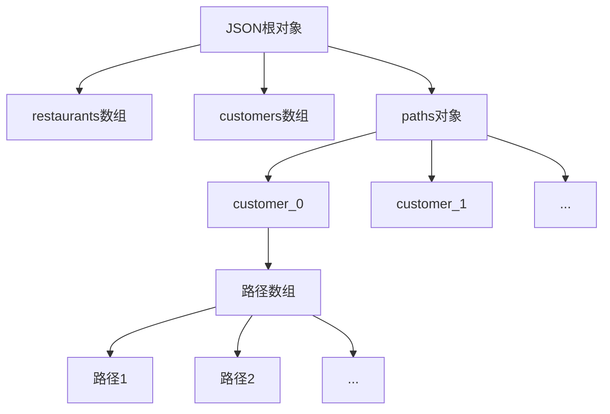
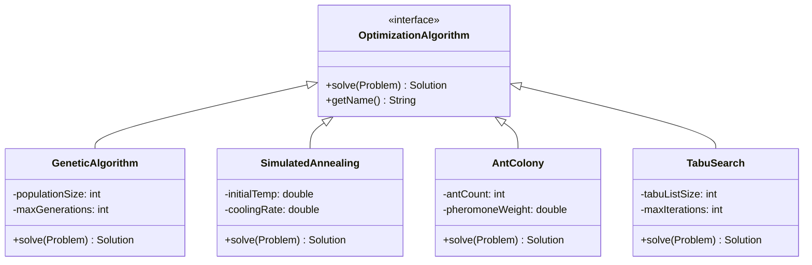

# 外卖配送路径优化系统

## 任务描述

考虑一个面向在线用餐订单的取货和交付场景下的司机路线规划问题。

问题描述：

场景： 在线用餐订单的取货和交付。
角色： 平台司机，负责从餐厅接单并交付给客户。
目标： 通过交付尽可能多昂贵的订单来最大化收入（优化目标是最小化成本）。
环境：
市内有多家餐厅（订单的取货地点）。
与其中一家餐厅相关的订单会动态到达送货公司的应用程序。
司机必须接受订单才能取货和送货。
行驶距离会给司机带来燃料成本。
路线规划：

司机从商家接单后开始配送，一次配送过程包含 n 个客户目的地（客户 1、客户 2、...、客户 n）。
前往每个客户有 m 条不同的路径。
路径属性：路径的距离、路径行驶的费用、路径消耗的时间。
约束条件：总时间不超过 C。
优化目标：

最小化车辆的总运输成本，包括行驶距离和行驶费用。

目标函数：

Minimize F(sol) = Σ(l<sub>i,dis</sub>) + Σ(l<sub>i,cost</sub>)

其中：
l<sub>i,dis</sub> 示服务第 i 个客户的路径距离。
l<sub>i,cost</sub> 表示服务第 i 个客户的路径费用。
约束条件：

总时间约束：

Σ(q<sub>i,time</sub>) ≤ C

其中：
q<sub>i,time</sub> 表示服务第 i 个客户所需的时间。
求解方法：

采用任意一种算法策略求解该问题。

实验要求：

生成一组测试用例，完成以下实验：

实验 1：算法求解的有效性： 评估找到的解是否足够好（例如，是否接近最优解，或者在可接受的范围内）。
实验 2：算法的高效性： 评估算法是否能够在尽可能短的时间内求得较优的解。
实验 3：算法稳定性： 评估算法在多次运行时，给出的优化结果变化是否较小。
实验 4：算法的适应性： 评估算法在不同规模、不同参数的测试用例下的表现，即算法的鲁棒性。例如，不同数量的客户、不同的路径选择、不同的时间约束等。
总结：

这是一个典型的带约束的路径优化问题，目标是最小化成本（距离和费用），约束是总时间。需要选择合适的算法（例如：遗传算法、蚁群算法、模拟退火算法、禁忌搜索算法、分支定界法等），并设计实验来评估算法的有效性、高效性、稳定性和适应性。重点在于如何合理地表示问题、���计合适的算法、生成有效的测试用例，并进行充分的实验分析。

## 项目描述
本项目实现了一个基于遗传算法的外卖配送路径优化系统，用于解决在线用餐订单的取货和配送问题。系统旨在最小化配送成本的同时满足时间约束。

## 设计思路

### 1.数据集生成设计

#### 1.1 数据生成流程



#### 1.2. 数据结构设计



#### 1.3. 数据生成策略

1. **地理位置生成**
   - 使用上海市实际经纬度范围
   - 纬度范围：31.2°N - 31.4°N
   - 经度范围：121.3°E - 121.5°E

2. **路径属性计算**
   - 距离：1-10公里随机生成
   - 成本：基于距离计算，考虑0.8-1.2的随机系数
   - 时间：基于距离计算，考虑路况影响（3-5分钟/公里）

3. **数据规模**
   - 餐厅数量：可配置（默认10个）
   - 顾客数量：可配置（默认20个）
   - 每个顾客的可选路径数：可配置（默认5条）

#### 1.4. JSON数据格式



## 

### 2. 问题建模
- **决策变量**：每个顾客的配送路径选择
- **优化目标**：最小化总配送成本（包括距离成本和路径费用）
- **约束条件**：总配送时间不超过预设时限

### 3. 算法设计
系统实现了多种优化算法，用户可以根据需求选择不同的算法：

#### 3.1 遗传算法（Genetic Algorithm）

1. **编码方案**
   - 使用整数数组表示解，每个位置代表对应顾客选择的路径编号
   - 数组长度等于顾客数量

2. **适应度函数**
   - 基于总成本（距离 + 费用）
   - 对违反时间约束的解施加惩罚

3. **遗传操作**
   - 选择：采用锦标赛选择
   - 交叉：使用单点交叉
   - 变异：随机改变某个顾客的路径选择
   - 精英保留：保留最优的10%个体

#### 3.2 模拟退火算法（Simulated Annealing）

1. **状态表示**
   - 使用整数数组表示当前解
   - 随机选择邻域解进行状态转移

2. **温度控制**
   - 初始温度：100.0
   - 冷却系数：0.95
   - 终止温度：0.01

3. **邻域操作**
   - 随机选择一个顾客
   - 随机改变其路径选择

#### 3.3 蚁群算法（Ant Colony Optimization）

1. **信息素矩阵**
   - 维护顾客-路径选择的信息素浓度
   - 动态更新信息素

2. **状态转移规则**
   - 结合信息素浓度和启发式信息
   - 使用轮盘赌选择路径

3. **信息素更新**
   - 局部更新：蚂蚁移动后
   - 全局更新：迭代结束后

#### 3.4 禁忌搜索（Tabu Search）

1. **禁忌表设计**
   - 记录最近访问的解
   - 动态更新禁忌期限

2. **邻域搜索**
   - 评估所有非禁忌邻域解
   - 选择最优非禁忌解或特赦解

3. **多样化策略**
   - 长期记忆
   - 重启机制



#### 3.5 算法选择策略

用户可以通过以下方式选择算法：

1. **命令行参数**
```bash
java -jar delivery-optimizer.jar --algorithm [GA|SA|ACO|TS]
```

2. **配置文件**
```yaml
algorithm:
  type: GA  # GA|SA|ACO|TS
  parameters:
    # 算法特定参数
    GA:
      populationSize: 100
      maxGenerations: 1000
    SA:
      initialTemp: 100.0
      coolingRate: 0.95
    ACO:
      antCount: 50
      pheromoneWeight: 1.0
    TS:
      tabuListSize: 20
      maxIterations: 500
```

3. **算法性能对比**

| 算法 | 优点 | 缺点 | 适用场景 |
|------|------|------|----------|
| 遗传算法 | 全局搜索能力强，易于并行化 | 参数调优复杂 | 大规模问题 |
| 模拟退火 | 实现简单，易于收敛 | 可能陷入局部最优 | 中小规模问题 |
| 蚁群算法 | 收敛性好，适应性强 | 计算开销大 | 动态优化问题 |
| 禁忌搜索 | 避免循环，搜索高效 | 内存消耗大 | 组合优化问题 |

### 4. 系统架构
- **model包**：数据模型类（Customer, Restaurant, Path, Solution）
- **util包**：工具类（DataGenerator - 负责测试数据生成）
- **algorithm包**：算法实现（GeneticAlgorithm）
- **experiment包**：实验评估（ExperimentRunner）

## 使用说明

### 环境要求
- JDK 21
- Maven 3.x

### 安装步骤
1. 克隆项目 