# 外卖配送路径优化系统

[中文文档](README.md) | [English Documentation](README_EN.md)

## 任务描述

本项目旨在解决在线外卖配送场景下的路径优化问题。

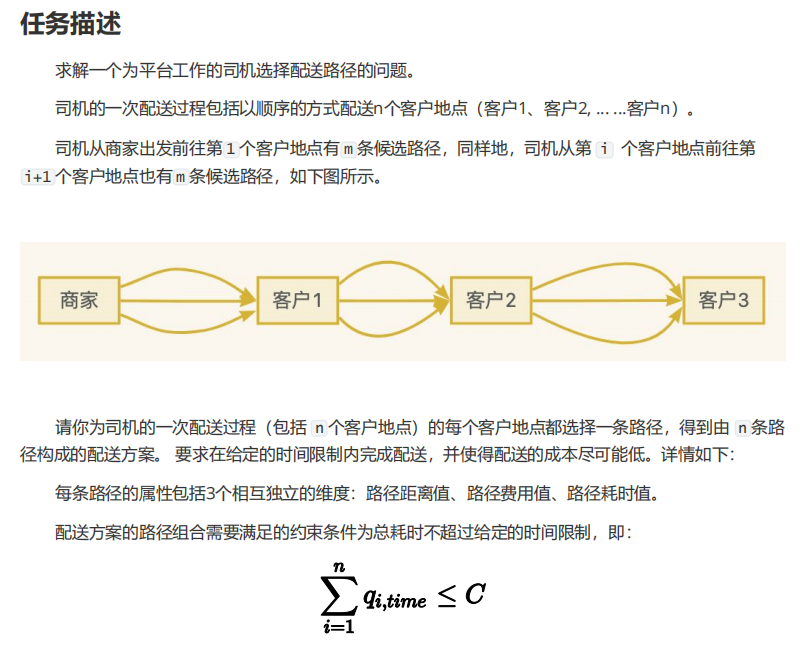

### 业务场景
- **角色**：平台配送司机
- **任务**：从餐厅取餐并配送给顾客
- **目标**：最小化总配送成本（包括距离成本和路径费用）

### 问题定义
1. **配送环境**
   - 市内分布多家餐厅（取餐点）
   - 订单动态到达系统
   - 司机需接单后进行配送
   - 行驶产生距离成本

2. **配送特征**
   - 一次配送服务n个顾客
   - 每个顾客有m条可选配送路径
   - 路径包含三个属性：距离、费用、时间

3. **决策变量**
   - 每个顾客的配送路径选择

4. **约束条件**
   - 总配送时间不超过预设时限C

5. **优化目标**

   ```
   Minimize F(sol) = Σ(l<sub>i,dis</sub>) + Σ(l<sub>i,cost</sub>)
   ```

其中：
l<sub>i,dis</sub> 表示服务第 i 个客户的路径距离。
l<sub>i,cost</sub> 表示服务第 i 个客户的路径费用。

6. **时间约束**
   ```
   Σ(q<sub>i,time</sub>) ≤ C
   ```

其中：
q<sub>i,time</sub> 表示服务第 i 个客户所需的时间。

### 实验要求

需要设计并完成以下四组实验：

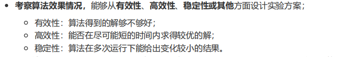

1. **有效性实验**
   - 评估解的质量
   - 验证是否接近最优解（当前的解与最优解的差距）
   - 检查解的可行性

2. **效率实验**
   - 测试算法运行时间
   - 分析时间复杂度
   - 评估求解速度

3. **稳定性实验**
   - 在同一个数据集下面多次运行对比
   - 分析结果波动
   - 评估算法稳定性

4. **适应性实验**
   - 同一个数据集给定不同的时间约束C


### 额外加分项任务

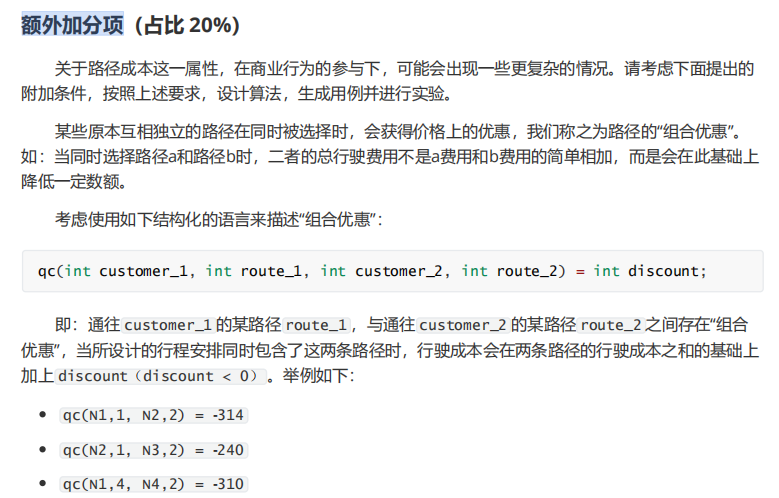

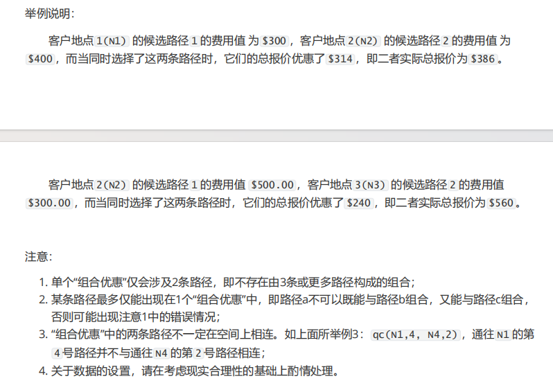

## 项目描述
本项目实现了一个基于遗传算法的外卖配送路径优化系统，用于解决在线用餐订单的取货和配送问题。系统旨在最小化配送成本的同时满足时间约束。

## 设计思路

### 1. 数据集生成设计

#### 1.0 数据生成策略

系统提供两种数据生成策略，用户可以根据需求选择：

###### 策略A：纯随机生成

完全随机生成所有路径，适合测试算法的鲁棒性：

```java
// 为每个顾客生成随机路径
for (int i = 0; i < customerCount; i++) {
    List<Path> paths = new ArrayList<>();
    for (int j = 0; j < pathsPerCustomer; j++) {
        double distance = 1 + random.nextDouble() * 9;  // 1-10公里
        double costFactor = 0.8 + random.nextDouble() * 0.4;
        double cost = distance * costFactor;
        double timePerKm = 3 + random.nextDouble() * 2;  // 3-5分钟/公里
        double time = distance * timePerKm;
        paths.add(new Path(distance, cost, time));
    }
}
```

特点：
- 完全随机生成
- 不保证存在可行解
- 更接近真实场景
- 适合测试算法的容错能力

###### 策略B：保底可行生成

为确保生成的数据集包含可行解，采用了"自顶向下"的时间分配策略：

1. **时间分配机制**
   ```java
   // 总时间约束 = 120分钟
   remainingTime = timeConstraint;
   
   // 为每个顾客预分配时间
   for (customer in customers) {
       maxTime = remainingTime * 0.5;  // 最多使用剩余时间的一半
       customerTime = random(2, min(maxTime - 2, 8));
       remainingTime -= customerTime;
   }
   ```

2. **路径生成策略**
   - **保底路径**：每个顾客至少有一条满足时间约束的路径
   - **随机路径**：其他路径随机生成，增加问题难度
   - **路径打乱**：随机打乱路径顺序，避免算法偏向

特点：
- 保证至少存在一个可行解
- 结合确定性和随机性
- 适合算法性能测试
- 便于结果验证

**策略选择建议：**
1. 算法开发测试阶段：使用策略B
2. 算法性能评估：使用策略B
3. 算法鲁棒性测试：使用策略A
4. 实际应用场景：使用策略A

3. **数据验证**
   ```java
   // 验证是否存在可行解
   for (customer in customers) {
       minTime = findMinTimePath(customer);
       totalTime += minTime;
       if (totalTime > timeConstraint) {
           return false;  // 数据集不可行
       }
   }
   ```

4. **参数配置**
   ```yaml
   dataGeneration:
     strategy: "B"          # 生成策略：A-纯随机，B-保底可行
     timeConstraint: 120.0  # 总时间约束
     minTimePerCustomer: 2.0
     maxTimePerCustomer: 10.0
     minDistance: 1.0
     maxDistance: 10.0
     costFactor:
       min: 0.8
       max: 1.2
   ```

#### 1.1 数据生成流程

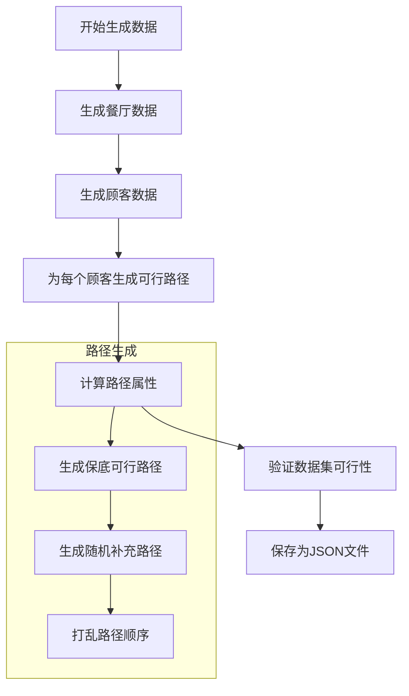

#### 1.2. 数据结构设计

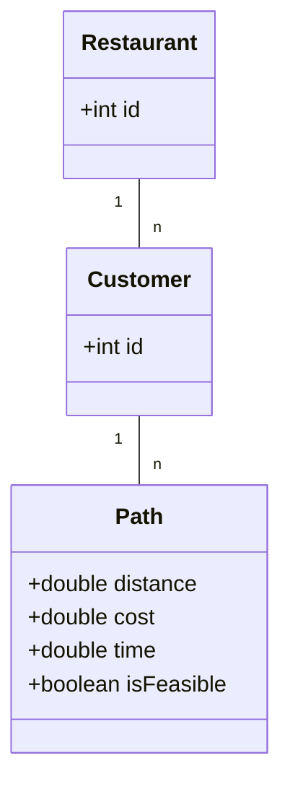

#### 1.3. 数据生成策略

1. **路径属性生成**
   - **保底路径**
     - 距离 = 分配时间 / 4.0（假设速度4分钟/公里）
     - 成本 = 距离 * (0.8-1.2的随机系数)
     - 时间 = 预分配的可行时间
   - **随机路径**
     - 距离：1-10公里随机生成
     - 成本：距离 * (0.8-1.2的随机系数)
     - 时间：距离 * (3-5分钟/公里)

2. **数据规模**
   - 餐厅数量：可配置（默认10个）
   - 顾客数量：可配置（默认20个）
   - 每个顾客的可选路径数：可配置（默认5条）

3. **可行性保证**
   - 时间分配：自顶向下，确保总时间约束
   - 路径生成：至少一条可行路径
   - 数据验证：检查最短时间路径组合

### 2. 问题建模
- **决策变量**：每个顾客的配送路径选择
- **优化目标**：最小化总配送成本（包括距离成本和路径费用）
- **约束条件**：总配送时间不超过预设时限

### 3. 算法设计
系统实现了多种优化算法，用户可以根据需求选择不同的算法：

#### 3.1 遗传算法（Genetic Algorithm）

遗传算法模拟了生物进化过程中的自然选择和遗传机制。

**基本原理：**
1. **染色体编码**：
   - 每个解用一个整数数组表示（染色体）
   - 数组长度等于顾客数量
   - 每个位置的值表示该顾客选择的路径编号

2. **适应度函数**
   - 基于总成本（距离 + 费用）
   - 对违反时间约束的解施加惩罚

3. **遗传操作**
   - 选择：采用锦标赛选择
   - 交叉：使用单点交叉
   - 变异：随机改变某个顾客的路径选择
   - 精英保留：保留最优的10%个体

**算法流程：**
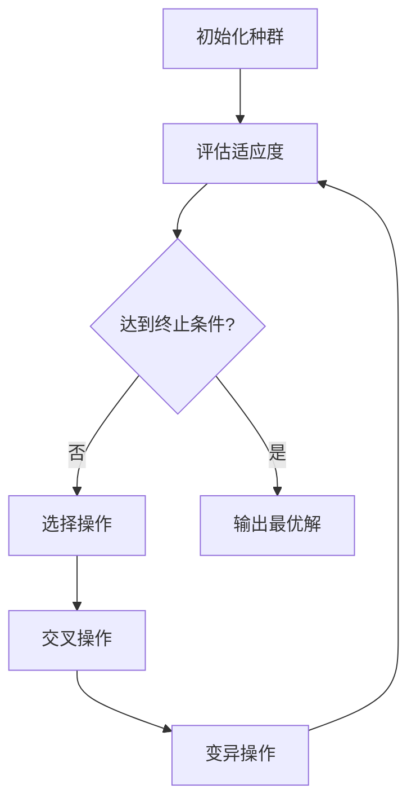

#### 3.2 模拟退火算法（Simulated Annealing）

模拟退火算法模拟了金属冷却过程中的退火现象。

**基本原理：**
- 在高温时，解可以自由变化（接受较差解的概率高）
- 温度降低时，解的变化逐渐"固定"（接受较差解的概率降低）
- 最终在低温时只接受更优的解

**核心参数：**
```yaml
初始温度: 100.0    # 开始时接受较差解的概率高
冷却系数: 0.95     # 控制温度下降速度
终止温度: 0.01     # 算法停止的温度阈值
```

**状态转移：**
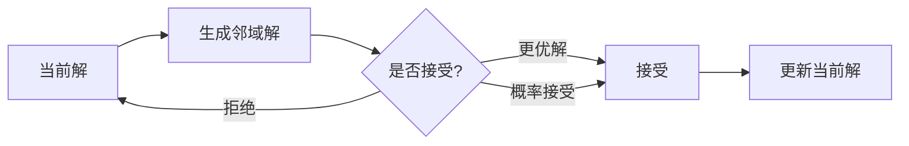

**接受概率计算：**
```java
if (newCost < currentCost) {
    return 1.0;  // 更优解直接接受
} else {
    // 根据温度和成本差值计算接受概率
    return Math.exp((currentCost - newCost) / temperature);
}
```

#### 3.3 蚁群算法（Ant Colony Optimization）

蚁群算法模拟了蚂蚁在寻找食物过程中的集体智能行为。


**基本原理：**
1. **信息素机制**
   - 蚂蚁在路径上留下信息素
   - 信息素浓度影响路径选择概率
   - 信息素会随时间蒸发

**核心组件：**
1. **路径选择**
   ```java
   概率 = (信息素浓度)^α * (启发式信息)^β
   启发式信息 = 1 / (距离 + 成本)
   ```

2. **信息素更新**
   ```java
   // 蒸发
   信息素 = (1 - ) * 信息素
   
   // 沉积
   信息素 += Q / 路径成本  // Q为常数
   ```

**算法流程：**
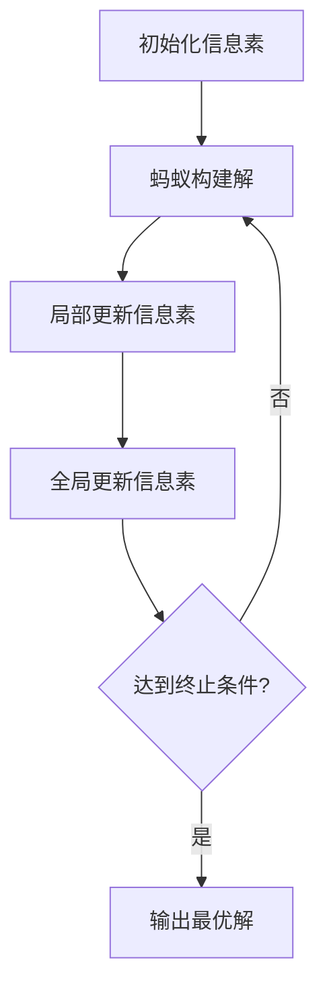

#### 3.4 禁忌搜索（Tabu Search）

禁忌搜索通过"记忆"机制来避免陷入局部最优。

**基本原理：**
- 维护一个禁忌表，记录最近访问过的解
- 禁止重复访问这些解，除非满足特赦准则
- 通过禁忌机制跳出局部最优

**核心组件：**
1. **禁忌表**
   ```java
   Queue<String> tabuList = new LinkedList<>();
   // 存储形如 "2:1->3" 的移动记录
   // 表示将顾客2的路径从1改为3
   ```

2. **特赦准则**
   ```java
   if (newSolution.cost < globalBestCost) {
       // 即使在禁忌表中也接受
       accept(newSolution);
   }
   ```

**搜索过程：**
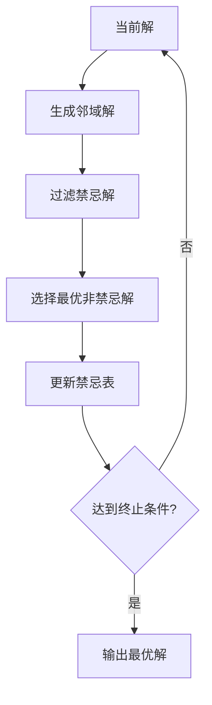

**算法比较：**
| 算法 | 优点 | 缺点 | 适用场景 | 关键参数 |
|------|------|------|----------|----------|
| 遗传算法 | 全局搜索能力强<br>易于并行化 | 参数调优复杂<br>收敛速度较慢 | 大规模问题<br>多目标优化 | 种群大小<br>交叉/变异概率 |
| 模拟退火 | 实现简单<br>收敛较快 | 可能陷入局部最优<br>参数敏感 | 中小规模问题<br>连续优化 | 初始温度<br>冷却速率 |
| 蚁群算法 | 收敛性好<br>适应性强 | 计算开销大<br>参数多 | 动态优化问题<br>路径规划 | 信息素权重<br>蒸发系数 |
| 禁忌搜索 | 避免循环<br>搜索高效 | 内存消耗大<br>邻域生成复杂 | 组合优化<br>调度问题 | 禁忌长度<br>邻域大小 |

**选择建议：**
1. 问题规模小，要求快速收敛：选择模拟退火
2. 问题规模大，需要全局最优：选择遗传算法
3. 动态变化的问题：选择蚁群算法
4. 容易陷入局部最优：选择禁忌搜索

#### 3.5 动态规划算法（Dynamic Programming）

动态规划算法通过将问题分解为子问题并存储子问题的解来获得最优解。

**基本原理：**
1. **状态定义**
   - 状态由当前顾客索引和累计时间组成
   - 使用记忆化搜索避免重复计算
   - 通过状态转移寻找最优解

2. **核心组件**
   ```java
   // 状态表示
   String state = customerIndex + ":" + currentTime;
   
   // 状态转移
   for (Path path : paths) {
       double newTime = currentTime + path.getTime();
       if (newTime <= timeConstraint) {
           double newCost = path.getCost() + findMinCost(nextCustomer, newTime);
           minCost = Math.min(minCost, newCost);
       }
   }
   ```

3. **记忆化存储**
   ```java
   class CacheEntry {
       double cost;      // 最小成本
       int[] path;       // 对应的路径选择
   }
   Map<String, CacheEntry> memo = new HashMap<>();
   ```

**算法流程：**
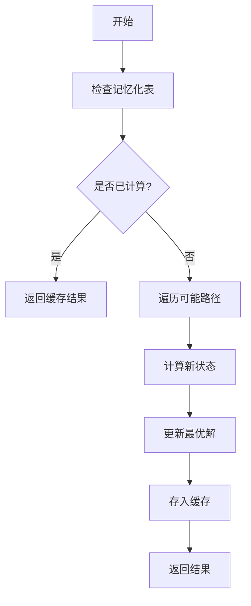

**优化策略：**
1. **路径排序**
   - 优先尝试时间较短的路径
   - 提高找到可行解的概率

2. **状态空间优化**
   - 减少时间精度
   - 控制状态数量

3. **贪心策略补充**
   - 当DP无法找到解时使用贪心
   - 保证算法的鲁棒性

#### 3.6 强化学习算法（Reinforcement Learning）

强化学习算法通过与环境交互学习最优策略。

**基本原理：**
1. **Q-learning框架**
   - 状态：当前顾客索引
   - 动作：选择的配送路径
   - 奖励：成本的负值

2. **核心组件**
   ```java
   // Q值更新
   Q(s,a) = Q(s,a) + α[R + γ·maxQ(s',a') - Q(s,a)]
   
   其中：
   α: 学习率
   γ: 折扣因子
   R: 即时奖励
   ```

3. **探索策略**
   ```java
   // ε-greedy策略
   if (random.nextDouble() < epsilon) {
       return randomAction();  // 探索
   } else {
       return bestAction();    // 利用
   }
   ```

**算法流程：**
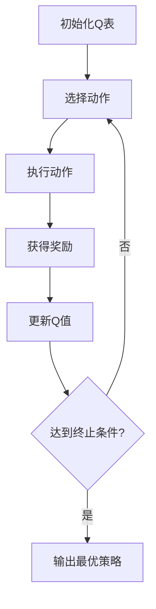

**关键特性：**
1. **自适应学习**
   - 通过多轮训练改进策略
   - 平衡探索与利用

2. **奖励设计**
   ```java
   reward = -(path.getDistance() + path.getCost());
   if (totalTime > timeConstraint) {
       reward -= penalty;  // 时间约束惩罚
   }
   ```

3. **收敛保证**
   - 足够的训练轮数
   - 适当的参数设置

**算法比较更新：**
| 算法 | 优点 | 缺点 | 适用场景 | 关键参数 |
|------|------|------|----------|----------|
| ... | ... | ... | ... | ... |
| 动态规划 | 保证最优解<br>求解速度快 | 状态空间大<br>内存消耗高 | 小规模问题<br>精确求解 | 状态定义<br>记忆化策略 |
| 强化学习 | 自适应性强<br>可在线学习 | 训练时间长<br>参数敏感 | 动态环境<br>连续决策 | 学习率<br>探索概率 |

**选择建议更新：**
1. 问题规模小，要求最优解：选择动态规划
2. 问题规模大，允许在线学习：选择强化学习
3. 其他情况参考原有建议

#### 3.7 回溯算法（Backtracking Algorithm）

回溯算法通过系统地搜索所有可能的解空间来找到最优解。它是一种暴力搜索方法，但通过剪枝策略可以大大减少搜索空间。

**基本原理：**
1. **状态表示**
   - 使用一个数组表示每个顾客选择的路径
   - 递归地尝试每个顾客的所有可能路径
   - 通过剪枝避免无效搜索

2. **核心组件**
   ```java
   // 状态记录
   class SearchState {
       int[] pathChoices;     // 当前路径选择
       double totalCost;      // 当前总成本
       double totalTime;      // 当前总时间
   }
   
   // 递归搜索
   void search(int customerIndex) {
       if (customerIndex == customerCount) {
           updateBestSolution();
           return;
       }
       
       for (Path path : availablePaths) {
           if (isPromising(path)) {  // 剪枝判断
               updateState(path);     // 更新状态
               search(customerIndex + 1);
               restoreState();        // 状态回溯
           }
       }
   }
   ```

**算法流程：**
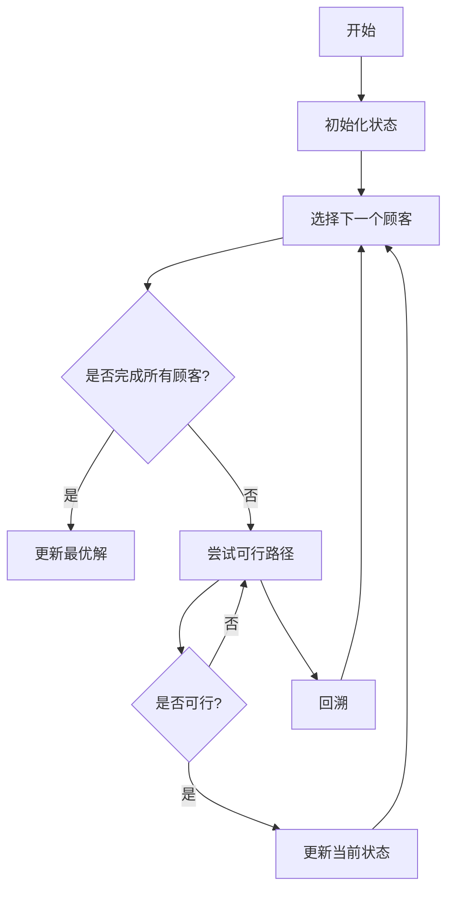

**优化策略：**
1. **剪枝优化**
   ```java
   boolean isPromising(Path path) {
       // 时间约束剪枝
       if (currentTime + path.getTime() > timeConstraint) {
           return false;
       }
       
       // 成本下界剪枝
       if (currentCost + path.getCost() > bestCost) {
           return false;
       }
       
       return true;
   }
   ```

2. **搜索顺序优化**
   - 优先尝试成本较低的路径
   - 按时间限制对路径排序
   - 启发式选择搜索分支

3. **状态空间压缩**
   - 预处理去除明显不可行的路径
   - 动态更新可行路径集合
   - 记忆化存储中间结果

**关键特性：**
1. **完备性**
   - 保证找到全局最优解
   - 可以证明解的最优性

2. **时间复杂度**
   - 最坏情况：O(m^n)，m为每个顾客的路径数，n为顾客数
   - 实际情况：通过剪枝可大幅降低

3. **适用范围**
   - 小规模问题求解
   - 需要最优解的场景
   - 可以接受较长运行时间

### 4. 系统架构
- **model包**：数据模型类（Customer, Restaurant, Path, Solution）
- **util包**：工具类（DataGenerator - 负责测试数据生成）
- **algorithm包**：算法实现（GeneticAlgorithm）
- **experiment包**：实验评估（ExperimentRunner）

## 实验结果

### 有效性实验：评估得出来的解是否接近最优解

我们以精确算法（回溯算法）的结果作为最优解

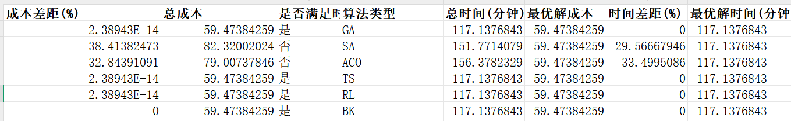

以某一次的有效性实验来分析 **成本差距 (%) 和总成本**：

- **GA、TS、RL、BK**算法的总成本和最优解成本完全一致（59.47384259），表明它们的解质量非常高，且几乎无成本差距（2.38943E-14，可以忽略）。
- **SA**和**ACO**算法的总成本（82.32和79.01）明显高于最优解，分别有**38.41%**和**32.84%**的成本差距，说明它们的解可能不是最优。

### 高效性实验：记录不同规模问题的运行时间

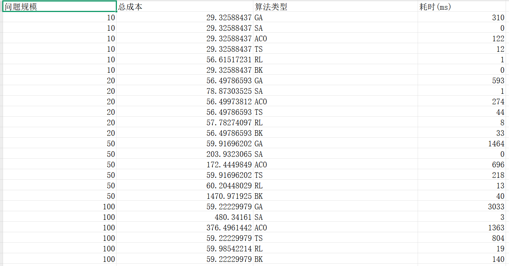

- ### 1. **耗时对比分析**

  - 耗时最短

    ：RL（1ms）、SA（0ms）。

    - RL 和 SA 不需要复杂的计算，在小规模问题中能够快速找到解。

  - 耗时最长

    ：GA（306ms）、ACO（129ms）。

    - GA 的种群迭代和 ACO 的路径优化过程较复杂，导致耗时增加。

  ### 2. **算法耗时简单分析？**

  - GA（遗传算法）：
    - 种群初始化、选择、交叉和变异操作需要大量计算。
    - 在大规模问题中，种群数量和迭代次数增加，导致耗时显著上升。
  - ACO（蚁群算法）：
    - 信息素的初始化和动态更新，以及路径优化涉及多次计算。
    - 问题规模增大时，路径的搜索空间变大，计算复杂度成倍增加。
  - TS（禁忌搜索）：
    - TS 需要对候选解进行反复迭代，规模越大，候选解评估的计算量越多。

  RL 的 Q-learning 和 SA 的简单启发式计算，对规模的敏感性较低。

  - RL（强化学习，Q-learning）：
    - 基于查表的方式（Q 表）直接选择动作，计算复杂度极低。
  - SA（模拟退火）：
    - 算法逻辑简单，只需逐步退火进行搜索，没有复杂的全局优化过程。
    - 其耗时主要受搜索步数影响，且对问题规模不敏感。

  ------

  ### **综合评价**

  - **高效算法**：RL 和 SA 在所有规模中耗时最低，适合需要快速解答的问题。
  - **复杂算法**：GA 和 ACO 随着问题规模增大，耗时显著增加，但在寻找全局最优解时具有优势。
  - **平衡算法**：TS 和 BK 在耗时上介于高效算法和复杂算法之间，适合平衡解质量和耗时的场景。

### 稳定性实验：记录多次运行的统计数据，查看变化

设置重复次数30次来计算方差

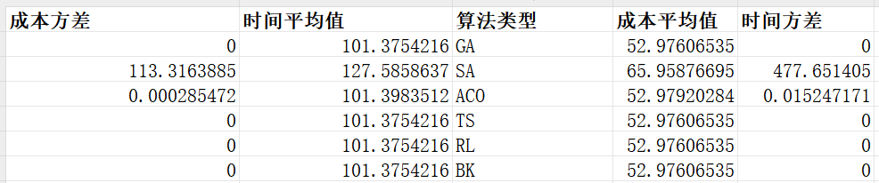

可以看出SA和ACO作为启发式算法，得到的结果具有随机性

### 适应性实验：记录不同时间约束下的表现

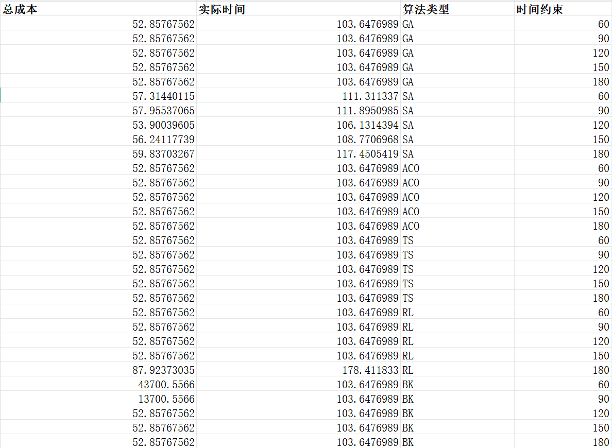

可以看见由于我们除了回溯算法以外都是将超出时间约束作为一个负惩罚，因此，这些算法都会以寻找总成本最小为主要目的。

因此当时间约束过小的时候，这些算法拿到的解是总成本较小但是超过了时间约束（可以看做算法的结果给出的是无解）