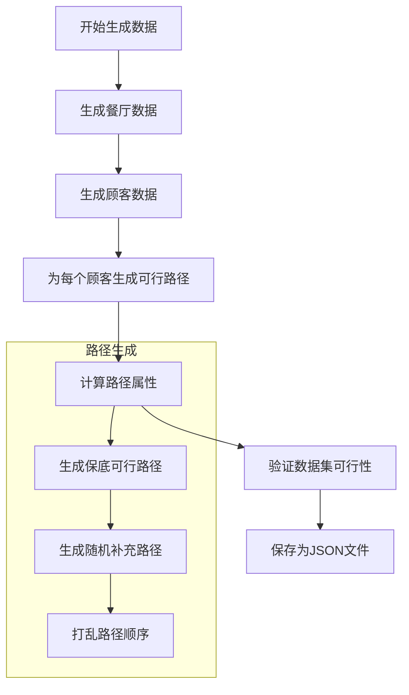
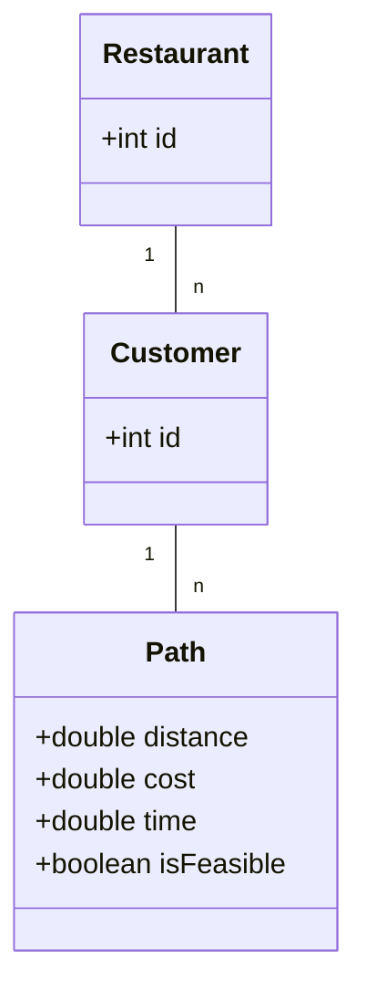
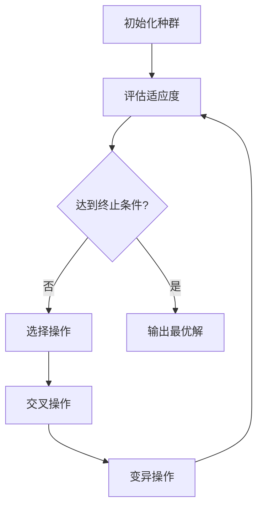
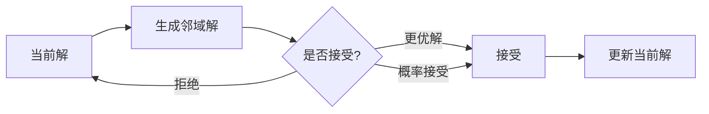
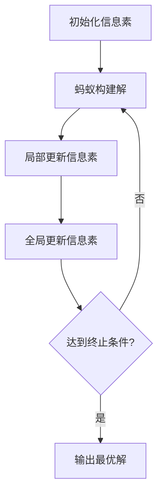
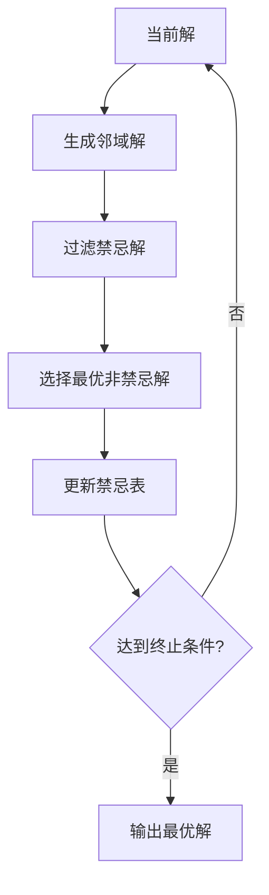
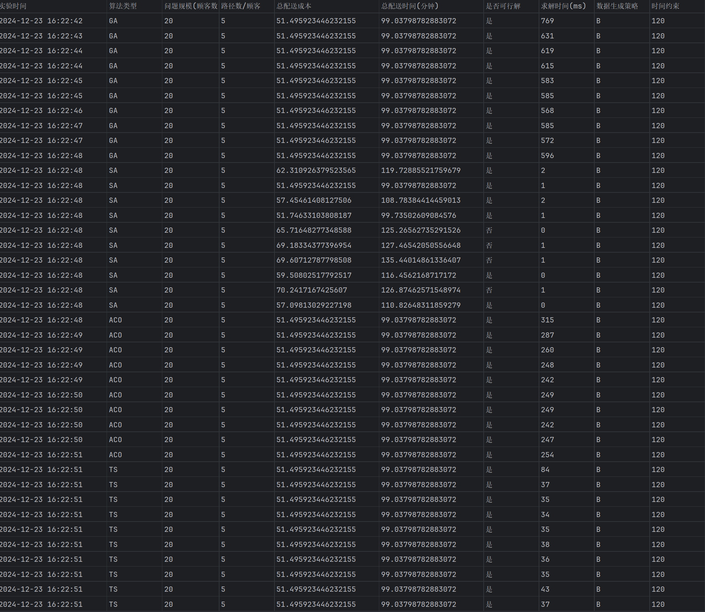

# 外卖配送路径优化系统

## 任务描述

本项目旨在解决在线外卖配送场景下的路径优化问题。

### 业务场景
- **角色**：平台配送司机
- **任务**：从餐厅取餐并配送给顾客
- **目标**：最小化总配送成本（包括距离成本和路径费用）

### 问题定义
1. **配送环境**
   - 市内分布多家餐厅（取餐点）
   - 订单动态到达系统
   - 司机需接单后进行配送
   - 行驶产生距离成本

2. **配送特征**
   - 一次配送服务n个顾客
   - 每个顾客有m条可选配送路径
   - 路径包含三个属性：距离、费用、时间

3. **决策变量**
   - 每个顾客的配送路径选择

4. **约束条件**
   - 总配送时间不超过预设时限C

5. **优化目标**

   ```
   Minimize F(sol) = Σ(l<sub>i,dis</sub>) + Σ(l<sub>i,cost</sub>)
   ```

其中：
l<sub>i,dis</sub> 表示服务第 i 个客户的路径距离。
l<sub>i,cost</sub> 表示服务第 i 个客户的路径费用。

6. **时间约束**
   ```
   Σ(q<sub>i,time</sub>) ≤ C
   ```

其中：
q<sub>i,time</sub> 表示服务第 i 个客户所需的时间。

### 实验要求

需要设计并完成以下四组实验：

1. **有效性实验**
   - 评估解的质量
   - 验证是否接近最优解
   - 检查解的可行性

2. **效率实验**
   - 测试算法运行时间
   - 分析时间复杂度
   - 评估求解速度

3. **稳定性实验**
   - 多次运行对比
   - 分析结果波动
   - 评估算法稳定性

4. **适应性实验**
   - 测试不同规模问题
   - 验证不同参数设置
   - 评估算法鲁棒性

## 项目描述
本项目实现了一个基于遗传算法的外卖配送路径优化系统，用于解决在线用餐订单的取货和配送问题。系统旨在最小化配送成本的同时满足时间约束。

## 设计思路

### 1. 数据集生成设计

#### 1.0 数据生成策略

系统提供两种数据生成策略，用户可以根据需求选择：

###### 策略A：纯随机生成

完全随机生成所有路径，适合测试算法的鲁棒性：

```java
// 为每个顾客生成随机路径
for (int i = 0; i < customerCount; i++) {
    List<Path> paths = new ArrayList<>();
    for (int j = 0; j < pathsPerCustomer; j++) {
        double distance = 1 + random.nextDouble() * 9;  // 1-10公里
        double costFactor = 0.8 + random.nextDouble() * 0.4;
        double cost = distance * costFactor;
        double timePerKm = 3 + random.nextDouble() * 2;  // 3-5分钟/公里
        double time = distance * timePerKm;
        paths.add(new Path(distance, cost, time));
    }
}
```

特点：
- 完全随机生成
- 不保证存在可行解
- 更接近真实场景
- 适合测试算法的容错能力

###### 策略B：保底可行生成

为确保生成的数据集包含可行解，采用了"自顶向下"的时间分配策略：

1. **时间分配机制**
   ```java
   // 总时间约束 = 120分钟
   remainingTime = timeConstraint;
   
   // 为每个顾客预分配时间
   for (customer in customers) {
       maxTime = remainingTime * 0.5;  // 最多使用剩余时间的一半
       customerTime = random(2, min(maxTime - 2, 8));
       remainingTime -= customerTime;
   }
   ```

2. **路径生成策略**
   - **保底路径**：每个顾客至少有一条满足时间约束的路径
   - **随机路径**：其他路径随机生成，增加问题难度
   - **路径打乱**：随机打乱路径顺序，避免算法偏向

特点：
- 保证至少存在一个可行解
- 结合确定性和随机性
- 适合算法性能测试
- 便于结果验证

**策略选择建议：**
1. 算法开发测试阶段：使用策略B
2. 算法性能评估：使用策略B
3. 算法鲁棒性测试：使用策略A
4. 实际应用场景：使用策略A

3. **数据验证**
   ```java
   // 验证是否存在可行解
   for (customer in customers) {
       minTime = findMinTimePath(customer);
       totalTime += minTime;
       if (totalTime > timeConstraint) {
           return false;  // 数据集不可行
       }
   }
   ```

4. **参数配置**
   ```yaml
   dataGeneration:
     strategy: "B"          # 生成策略：A-纯随机，B-保底可行
     timeConstraint: 120.0  # 总时间约束
     minTimePerCustomer: 2.0
     maxTimePerCustomer: 10.0
     minDistance: 1.0
     maxDistance: 10.0
     costFactor:
       min: 0.8
       max: 1.2
   ```

#### 1.1 数据生成流程



#### 1.2. 数据结构设计



#### 1.3. 数据生成策略

1. **路径属性生成**
   - **保底路径**
     - 距离 = 分配时间 / 4.0（假设速度4分钟/公里）
     - 成本 = 距离 * (0.8-1.2的随机系数)
     - 时间 = 预分配的可行时间
   - **随机路径**
     - 距离：1-10公里随机生成
     - 成本：距离 * (0.8-1.2的随机系数)
     - 时间：距离 * (3-5分钟/公里)

2. **数据规模**
   - 餐厅数量：可配置（默认10个）
   - 顾客数量：可配置（默认20个）
   - 每个顾客的可选路径数：可配置（默认5条）

3. **可行性保证**
   - 时间分配：自顶向下，确保总时间约束
   - 路径生成：至少一条可行路径
   - 数据验证：检查最短时间路径组合

### 2. 问题建模
- **决策变量**：每个顾客的配送路径选择
- **优化目标**：最小化总配送成本（包括距离成本和路径费用）
- **约束条件**：总配送时间不超过预设时限

### 3. 算法设计
系统实现了多种优化算法，用户可以根据需求选择不同的算法：

#### 3.1 遗传算法（Genetic Algorithm）

遗传算法模拟了生物进化过程中的自然选择和遗传机制。

**基本原理：**
1. **染色体编码**：
   - 每个解用一个整数数组表示（染色体）
   - 数组长度等于顾客数量
   - 每个位置的值表示该顾客选择的路径编号

2. **适应度函数**
   - 基于总成本（距离 + 费用）
   - 对违反时间约束的解施加惩罚

3. **遗传操作**
   - 选择：采用锦标赛选择
   - 交叉：使用单点交叉
   - 变异：随机改变某个顾客的路径选择
   - 精英保留：保留最优的10%个体

**算法流程：**


#### 3.2 模拟退火算法（Simulated Annealing）

模拟退火算法模拟了金属冷却过程中的退火现象。

**基本原理：**
- 在高温时，解可以自由变化（接受较差解的概率高）
- 温度降低时，解的变化逐渐"固定"（接受较差解的概率降低）
- 最终在低温时只接受更优的解

**核心参数：**
```yaml
初始温度: 100.0    # 开始时接受较差解的概率高
冷却系数: 0.95     # 控制温度下降速度
终止温度: 0.01     # 算法停止的温度阈值
```

**状态转移：**


**接受概率计算：**
```java
if (newCost < currentCost) {
    return 1.0;  // 更优解直接接受
} else {
    // 根据温度和成本差值计算接受概率
    return Math.exp((currentCost - newCost) / temperature);
}
```

#### 3.3 蚁群算法（Ant Colony Optimization）

蚁群算法模拟了蚂蚁在寻找食物过程中的集体智能行为。


**基本原理：**
1. **信息素机制**
   - 蚂蚁在路径上留下信息素
   - 信息素浓度影响路径选择概率
   - 信息素会随时间蒸发

**核心组件：**
1. **路径选择**
   ```java
   概率 = (信息素浓度)^α * (启发式信息)^β
   启发式信息 = 1 / (距离 + 成本)
   ```

2. **信息素更新**
   ```java
   // 蒸发
   信息素 = (1 - ) * 信息素
   
   // 沉积
   信息素 += Q / 路径成本  // Q为常数
   ```

**算法流程：**


#### 3.4 禁忌搜索（Tabu Search）

禁忌搜索通过"记忆"机制来避免陷入局部最优。

**基本原理：**
- 维护一个禁忌表，记录最近访问过的解
- 禁止重复访问这些解，除非满足特赦准则
- 通过禁忌机制跳出局部最优

**核心组件：**
1. **禁忌表**
   ```java
   Queue<String> tabuList = new LinkedList<>();
   // 存储形如 "2:1->3" 的移动记录
   // 表示将顾客2的路径从1改为3
   ```

2. **特赦准则**
   ```java
   if (newSolution.cost < globalBestCost) {
       // 即使在禁忌表中也接受
       accept(newSolution);
   }
   ```

**搜索过程：**


**算法比较：**
| 算法 | 优点 | 缺点 | 适用场景 | 关键参数 |
|------|------|------|----------|----------|
| 遗传算法 | 全局搜索能力强<br>易于并行化 | 参数调优复杂<br>收敛速度较慢 | 大规模问题<br>多目标优化 | 种群大小<br>交叉/变异概率 |
| 模拟退火 | 实现简单<br>收敛较快 | 可能陷入局部最优<br>参数敏感 | 中小规模问题<br>连续优化 | 初始温度<br>冷却速率 |
| 蚁群算法 | 收敛性好<br>适应性强 | 计算开销大<br>参数多 | 动态优化问题<br>路径规划 | 信息素权重<br>蒸发系数 |
| 禁忌搜索 | 避免循环<br>搜索高效 | 内存消耗大<br>邻域生成复杂 | 组合优化<br>调度问题 | 禁忌长度<br>邻域大小 |

**选择建议：**
1. 问题规模小，要求快速收敛：选择模拟退火
2. 问题规模大，需要全局最优：选择遗传算法
3. 动态变化的问题：选择蚁群算法
4. 容易陷入局部最优：选择禁忌搜索

### 4. 系统架构
- **model包**：数据模型类（Customer, Restaurant, Path, Solution）
- **util包**：工具类（DataGenerator - 负责测试数据生成）
- **algorithm包**：算法实现（GeneticAlgorithm）
- **experiment包**：实验评估（ExperimentRunner）

## 使用说明

### 环境要求
- JDK 21
- Maven 3.x

### 安装步骤
1. 克隆项目 

## 实验结果

在同一个数据集下的四种算法

