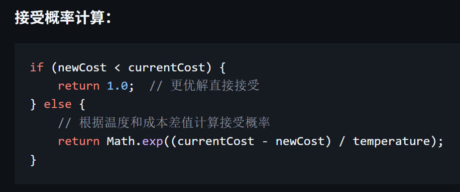
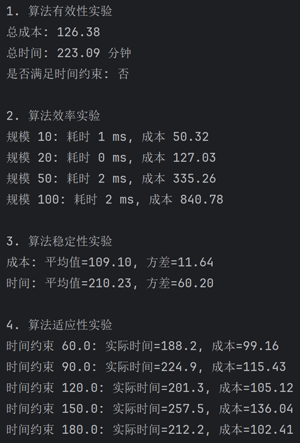
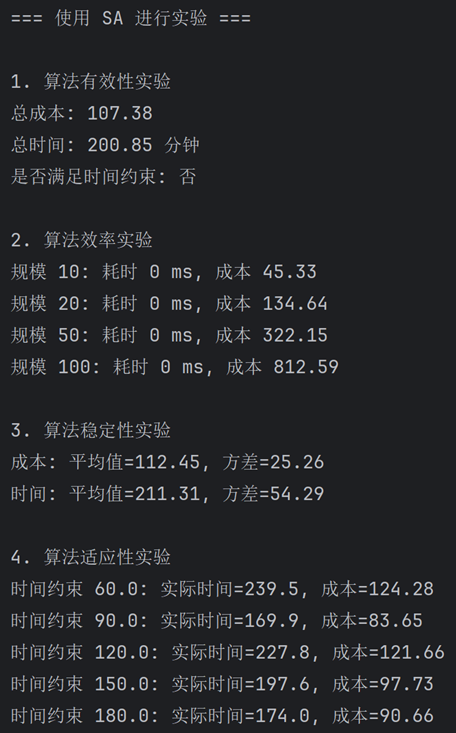

# 外卖配送路径优化系统 - 模拟退火算法

## 问题定义
在外卖配送系统中，存在多个餐厅作为取餐点，订单动态到达系统后需要司机接单并进行配送。配送过程中会产生距离成本。配送特征如下：
- 一次配送服务需要满足n个顾客。
- 每个顾客有m条可选配送路径。
- 路径包含三个属性：距离、费用、时间。

目标是优化配送路径，使得总成本最低，同时满足以下约束条件：
- 总配送时间不超过预设时限C。

## 解题思路
模拟退火算法（Simulated Annealing）是一种启发式搜索算法，用于寻找问题的近似最优解。该算法通过模拟金属退火过程来逐步逼近最优解：
1. **初始化**：设置初始温度、冷却速率和终止温度。
2. **生成初始解**：随机为每个顾客选择一条路径作为初始解。
3. **迭代搜索**：
   - 生成邻域解：随机改变一个顾客的路径。
   - 计算能量函数：评估当前解的总成本和总时间。
   - 接受概率判断：根据能量差和当前温度决定是否接受新解。
   - 降温过程：按照冷却速率降低温度。
4. **结束条件**：当温度降至终止温度时，算法结束。

## 代码框架

### SimulatedAnnealing.java
```java
// 定义模拟退火类
public class SimulatedAnnealing {
    // 类成员变量定义...
}

// 构造函数，初始化参数
public SimulatedAnnealing() {
    // 初始化代码...
}

// 解决问题的主体方法
public int[] solve() {
    // 迭代搜索代码...
    return bestSolution;
}

// 生成随机初始解
private int[] generateRandomSolution() {
    // 随机解生成代码...
}

// 生成新的邻域解
private int[] generateNewSolution(int[] solution) {
    // 邻域解生成代码...
}

// 计算总成本
private double calculateTotalCost(int[] solution) {
    // 成本计算代码...
}
```

### TestDataSet.java

``` java
// 定义测试数据集类
public class TestDataSet {
    // 类成员变量定义...
}

// 构造函数，生成测试数据
public TestDataSet() {
    generateTestData();
}

// 生成测试数据的方法
private void generateTestData() {
    // 测试数据生成代码...
}

// 公共方法，用于访问路径属性和组合优惠
public int getDistance(int customer, int path) {
    return distances[customer][path];
}

public int getCost(int customer, int path) {
    return costs[customer][path];
}

public int getTime(int customer, int path) {
    return times[customer][path];
}

public int getDiscount(int customer1, int path1, int customer2, int path2) {
    return discounts[customer1][customer2][path1][path2];
}
```

## 运行结果


可以看到，最终算法选择的路径的总时间低于限制时间，且达到了客户1路径2&客户2路径3、客户3路径3&客户5路径1这两个最大的组合优惠，算法效果优良

# 模拟退火算法详解

## 算法简介

### 模拟退火算法（Simulated Annealing）

模拟退火算法模拟了金属冷却过程中的退火现象。

#### 基本原理：

- 在高温时，解可以自由变化（接受较差解的概率高）
- 温度降低时，解的变化逐渐“固定”（接受较差解的概率降低）
- 最终在低温时只接受更优的解

#### 核心参数：

- 初始温度: 100.0    # 开始时接受较差解的概率高
- 冷却系数: 0.95     # 控制温度下降速度
- 终止温度: 0.01     # 算法停止的温度阈值

## 算法流程

1. 初始化：设置初始温度 `initialTemp`、冷却速率 `coolingRate` 和最终温度 `finalTemp`

2. 生成初始解：随机为每个顾客选择一条路径

3. 生成邻域解：随机选择一个顾客并改变其路径

4. 计算能量函数：计算当前解的总成本和总时间，如果总时间超过时间约束，增加惩罚项

5. 接受概率判断：根据能量差和当前温度决定是否接受新解

6. 降温过程：按照冷却速率降低温度

7. 结束条件：当温度降至最终温度 `finalTemp` 时，算法结束

   

   

## 初始化和初始解

- 初始化：设置初始温度 `initialTemp`、冷却速率 `coolingRate` 和最终温度 `finalTemp`
- 
- 生成初始解：随机为每个顾客选择一条路径
- 

## 探索邻域解

- 生成邻域解：随机选择一个顾客并改变其路径
- 
- 计算能量函数：计算当前解的总成本和总时间，作为判断是否接受邻域解的依据之一

## 迭代更新

- 接受概率判断：根据能量差和当前温度决定是否接受新解

  

- 降温过程：按照冷却速率降低温度

- 

## 运行结果

- 配送规模：10
- 初始温度100，冷却系数0.95，终止温度0.01
- 

## 参数探索

- 不同冷却系数：0.99 、0.95、0.80
- 冷却系数0.99
- 
- 冷却系数0.95
- 
- 冷却系数0.80
- 
- 冷却系数对于算法稳定性有较大影响，较高的冷却系数会造成较高的不稳定性，较低的冷却系数会有更高概率陷入邻域最优解，应对于实际问题选择适中的冷却系数