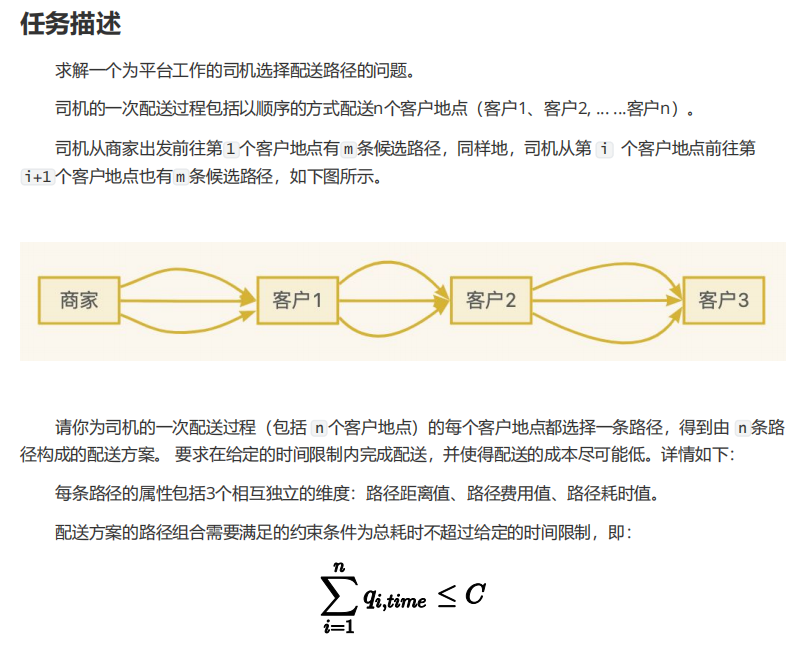
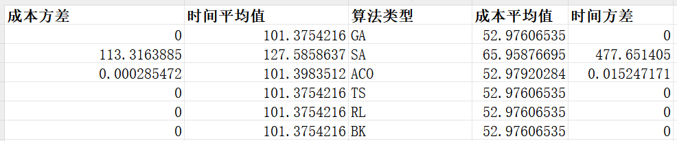
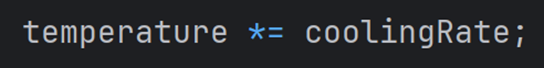

# 外卖配送路径优化系统

[TOC]


## 任务描述

本项目旨在解决在线外卖配送场景下的路径优化问题。



### 业务场景
- **角色**：平台配送司机
- **任务**：从餐厅取餐并配送给顾客
- **目标**：最小化总配送成本（包括距离成本和路径费用）

### 问题定义
1. **配送环境**
   - 市内分布多家餐厅（取餐点）
   - 订单动态到达系统
   - 司机需接单后进行配送
   - 行驶产生距离成本

2. **配送特征**
   - 一次配送服务n个顾客
   - 每个顾客有m条可选配送路径
   - 路径包含三个属性：距离、费用、时间

3. **决策变量**
   - 每个顾客的配送路径选择

4. **约束条件**
   - 总配送时间不超过预设时限C

5. **优化目标**

   ```
   Minimize F(sol) = Σ(l<sub>i,dis</sub>) + Σ(l<sub>i,cost</sub>)
   ```

其中：
l<sub>i,dis</sub> 表示服务第 i 个客户的路径距离。
l<sub>i,cost</sub> 表示服务第 i 个客户的路径费用。

6. **时间约束**
   ```
   Σ(q<sub>i,time</sub>) ≤ C
   ```

其中：
q<sub>i,time</sub> 表示服务第 i 个客户所需的时间。

### 实验要求

需要设计并完成以下四组实验：


1. **有效性实验**
   - 评估解的质量
   - 验证是否接近最优解（当前的解与最优解的差距）
   - 检查解的可行性

2. **效率实验**
   - 测试算法运行时间
   - 分析时间复杂度
   - 评估求解速度

3. **稳定性实验**
   - 在同一个数据集下面多次运行对比
   - 分析结果波动
   - 评估算法稳定性

4. **适应性实验**
   - 同一个数据集给定不同的时间约束C


### 额外加分项任务


## 项目描述
本项目实现了一个基于遗传算法的外卖配送路径优化系统，用于解决在线用餐订单的取货和配送问题。系统旨在最小化配送成本的同时满足时间约束。

## 设计思路

### 1. 数据集生成设计

#### 1.0 数据生成策略

系统提供两种数据生成策略，用户可以根据需求选择：

###### 策略A：纯随机生成

完全随机生成所有路径，适合测试算法的鲁棒性：

```java
// 为每个顾客生成随机路径
for (int i = 0; i < customerCount; i++) {
    List<Path> paths = new ArrayList<>();
    for (int j = 0; j < pathsPerCustomer; j++) {
        double distance = 1 + random.nextDouble() * 9;  // 1-10公里
        double costFactor = 0.8 + random.nextDouble() * 0.4;
        double cost = distance * costFactor;
        double timePerKm = 3 + random.nextDouble() * 2;  // 3-5分钟/公里
        double time = distance * timePerKm;
        paths.add(new Path(distance, cost, time));
    }
}
```

特点：
- 完全随机生成
- 不保证存在可行解
- 更接近真实场景
- 适合测试算法的容错能力

###### 策略B：保底可行生成

为确保生成的数据集包含可行解，采用了"自顶向下"的时间分配策略：

1. **时间分配机制**
   ```java
   // 总时间约束 = 120分钟
   remainingTime = timeConstraint;
   
   // 为每个顾客预分配时间
   for (customer in customers) {
       maxTime = remainingTime * 0.5;  // 最多使用剩余时间的一半
       customerTime = random(2, min(maxTime - 2, 8));
       remainingTime -= customerTime;
   }
   ```

2. **路径生成策略**
   - **保底路径**：每个顾客至少有一条满足时间约束的路径
   - **随机路径**：其他路径随机生成，增加问题难度
   - **路径打乱**：随机打乱路径顺序，避免算法偏向

特点：
- 保证至少存在一个可行解
- 结合确定性和随机性
- 适合算法性能测试
- 便于结果验证

**策略选择建议：**
1. 算法开发测试阶段：使用策略B
2. 算法性能评估：使用策略B
3. 算法鲁棒性测试：使用策略A
4. 实际应用场景：使用策略A

3. **数据验证**
   ```java
   // 验证是否存在可行解
   for (customer in customers) {
       minTime = findMinTimePath(customer);
       totalTime += minTime;
       if (totalTime > timeConstraint) {
           return false;  // 数据集不可行
       }
   }
   ```

4. **参数配置**
   ```yaml
   dataGeneration:
     strategy: "B"          # 生成策略：A-纯随机，B-保底可行
     timeConstraint: 120.0  # 总时间约束
     minTimePerCustomer: 2.0
     maxTimePerCustomer: 10.0
     minDistance: 1.0
     maxDistance: 10.0
     costFactor:
       min: 0.8
       max: 1.2
   ```

#### 1.1 数据生成流程


#### 1.2. 数据结构设计


#### 1.3. 数据生成策略

1. **路径属性生成**
   - **保底路径**
     - 距离 = 分配时间 / 4.0（假设速度4分钟/公里）
     - 成本 = 距离 * (0.8-1.2的随机系数)
     - 时间 = 预分配的可行时间
   - **随机路径**
     - 距离：1-10公里随机生成
     - 成本：距离 * (0.8-1.2的随机系数)
     - 时间：距离 * (3-5分钟/公里)

2. **数据规模**
   - 餐厅数量：可配置（默认10个）
   - 顾客数量：可配置（默认20个）
   - 每个顾客的可选路径数：可配置（默认5条）

3. **可行性保证**
   - 时间分配：自顶向下，确保总时间约束
   - 路径生成：至少一条可行路径
   - 数据验证：检查最短时间路径组合

### 2. 问题建模
- **决策变量**：每个顾客的配送路径选择
- **优化目标**：最小化总配送成本（包括距离成本和路径费用）
- **约束条件**：总配送时间不超过预设时限

### 3. 算法简单介绍
系统实现了多种优化算法，用户可以根据需求选择不同的算法：

#### 3.1 遗传算法（Genetic Algorithm）

遗传算法模拟了生物进化过程中的自然选择和遗传机制。

**基本原理：**
1. **染色体编码**：
   - 每个解用一个整数数组表示（染色体）
   - 数组长度等于顾客数量
   - 每个位置的值表示该顾客选择的路径编号

2. **适应度函数**
   - 基于总成本（距离 + 费用）
   - 对违反时间约束的解施加惩罚

3. **遗传操作**
   - 选择：采用锦标赛选择
   - 交叉：使用单点交叉
   - 变异：随机改变某个顾客的路径选择
   - 精英保留：保留最优的10%个体

**算法流程：**


#### 3.2 模拟退火算法（Simulated Annealing）

模拟退火算法模拟了金属冷却过程中的退火现象。

**基本原理：**
- 在高温时，解可以自由变化（接受较差解的概率高）
- 温度降低时，解的变化逐渐"固定"（接受较差解的概率降低）
- 最终在低温时只接受更优的解

**核心参数：**
```yaml
初始温度: 100.0    # 开始时接受较差解的概率高
冷却系数: 0.95     # 控制温度下降速度
终止温度: 0.01     # 算法停止的温度阈值
```

**状态转移：**


**接受概率计算：**
```java
if (newCost < currentCost) {
    return 1.0;  // 更优解直接接受
} else {
    // 根据温度和成本差值计算接受概率
    return Math.exp((currentCost - newCost) / temperature);
}
```

#### 3.3 蚁群算法（Ant Colony Optimization）

蚁群算法模拟了蚂蚁在寻找食物过程中的集体智能行为。


**基本原理：**
1. **信息素机制**
   - 蚂蚁在路径上留下信息素
   - 信息素浓度影响路径选择概率
   - 信息素会随时间蒸发

**核心组件：**
1. **路径选择**
   ```java
   概率 = (信息素浓度)^α * (启发式信息)^β
   启发式信息 = 1 / (距离 + 成本)
   ```

2. **信息素更新**
   ```java
   // 蒸发
   信息素 = (1 - ) * 信息素
   
   // 沉积
   信息素 += Q / 路径成本  // Q为常数
   ```

**算法流程：**


#### 3.4 禁忌搜索（Tabu Search）

禁忌搜索通过"记忆"机制来避免陷入局部最优。

**基本原理：**
- 维护一个禁忌表，记录最近访问过的解
- 禁止重复访问这些解，除非满足特赦准则
- 通过禁忌机制跳出局部最优

**核心组件：**
1. **禁忌表**
   ```java
   Queue<String> tabuList = new LinkedList<>();
   // 存储形如 "2:1->3" 的移动记录
   // 表示将顾客2的路径从1改为3
   ```

2. **特赦准则**
   ```java
   if (newSolution.cost < globalBestCost) {
       // 即使在禁忌表中也接受
       accept(newSolution);
   }
   ```

**搜索过程：**


**算法比较：**
| 算法 | 优点 | 缺点 | 适用场景 | 关键参数 |
|------|------|------|----------|----------|
| 遗传算法 | 全局搜索能力强<br>易于并行化 | 参数调优复杂<br>收敛速度较慢 | 大规模问题<br>多目标优化 | 种群大小<br>交叉/变异概率 |
| 模拟退火 | 实现简单<br>收敛较快 | 可能陷入局部最优<br>参数敏感 | 中小规模问题<br>连续优化 | 初始温度<br>冷却速率 |
| 蚁群算法 | 收敛性好<br>适应性强 | 计算开销大<br>参数多 | 动态优化问题<br>路径规划 | 信息素权重<br>蒸发系数 |
| 禁忌搜索 | 避免循环<br>搜索高效 | 内存消耗大<br>邻域生成复杂 | 组合优化<br>调度问题 | 禁忌长度<br>邻域大小 |

**选择建议：**
1. 问题规模小，要求快速收敛：选择模拟退火
2. 问题规模大，需要全局最优：选择遗传算法
3. 动态变化的问题：选择蚁群算法
4. 容易陷入局部最优：选择禁忌搜索

#### 3.5 动态规划算法（Dynamic Programming）

动态规划算法通过将问题分解为子问题并存储子问题的解来获得最优解。

**基本原理：**
1. **状态定义**
   - 状态由当前顾客索引和累计时间组成
   - 使用记忆化搜索避免重复计算
   - 通过状态转移寻找最优解

2. **核心组件**
   ```java
   // 状态表示
   String state = customerIndex + ":" + currentTime;
   
   // 状态转移
   for (Path path : paths) {
       double newTime = currentTime + path.getTime();
       if (newTime <= timeConstraint) {
           double newCost = path.getCost() + findMinCost(nextCustomer, newTime);
           minCost = Math.min(minCost, newCost);
       }
   }
   ```

3. **记忆化存储**
   ```java
   class CacheEntry {
       double cost;      // 最小成本
       int[] path;       // 对应的路径选择
   }
   Map<String, CacheEntry> memo = new HashMap<>();
   ```

**算法流程：**


**优化策略：**
1. **路径排序**
   - 优先尝试时间较短的路径
   - 提高找到可行解的概率

2. **状态空间优化**
   - 减少时间精度
   - 控制状态数量

3. **贪心策略补充**
   - 当DP无法找到解时使用贪心
   - 保证算法的鲁棒性

#### 3.6 强化学习算法（Reinforcement Learning）

强化学习算法通过与环境交互学习最优策略。

**基本原理：**
1. **Q-learning框架**
   - 状态：当前顾客索引
   - 动作：选择的配送路径
   - 奖励：成本的负值

2. **核心组件**
   ```java
   // Q值更新
   Q(s,a) = Q(s,a) + α[R + γ·maxQ(s',a') - Q(s,a)]
   
   其中：
   α: 学习率
   γ: 折扣因子
   R: 即时奖励
   ```

3. **探索策略**
   ```java
   // ε-greedy策略
   if (random.nextDouble() < epsilon) {
       return randomAction();  // 探索
   } else {
       return bestAction();    // 利用
   }
   ```

**算法流程：**


**关键特性：**
1. **自适应学习**
   - 通过多轮训练改进策略
   - 平衡探索与利用

2. **奖励设计**
   ```java
   reward = -(path.getDistance() + path.getCost());
   if (totalTime > timeConstraint) {
       reward -= penalty;  // 时间约束惩罚
   }
   ```

3. **收敛保证**
   - 足够的训练轮数
   - 适当的参数设置

**算法比较更新：**
| 算法 | 优点 | 缺点 | 适用场景 | 关键参数 |
|------|------|------|----------|----------|
| ... | ... | ... | ... | ... |
| 动态规划 | 保证最优解<br>求解速度快 | 状态空间大<br>内存消耗高 | 小规模问题<br>精确求解 | 状态定义<br>记忆化策略 |
| 强化学习 | 自适应性强<br>可在线学习 | 训练时间长<br>参数敏感 | 动态环境<br>连续决策 | 学习率<br>探索概率 |

**选择建议更新：**
1. 问题规模小，要求最优解：选择动态规划
2. 问题规模大，允许在线学习：选择强化学习
3. 其他情况参考原有建议

#### 3.7 回溯算法（Backtracking Algorithm）

回溯算法通过系统地搜索所有可能的解空间来找到最优解。它是一种暴力搜索方法，但通过剪枝策略可以大大减少搜索空间。

**基本原理：**
1. **状态表示**
   - 使用一个数组表示每个顾客选择的路径
   - 递归地尝试每个顾客的所有可能路径
   - 通过剪枝避免无效搜索

2. **核心组件**
   ```java
   // 状态记录
   class SearchState {
       int[] pathChoices;     // 当前路径选择
       double totalCost;      // 当前总成本
       double totalTime;      // 当前总时间
   }
   
   // 递归搜索
   void search(int customerIndex) {
       if (customerIndex == customerCount) {
           updateBestSolution();
           return;
       }
       
       for (Path path : availablePaths) {
           if (isPromising(path)) {  // 剪枝判断
               updateState(path);     // 更新状态
               search(customerIndex + 1);
               restoreState();        // 状态回溯
           }
       }
   }
   ```

**算法流程：**


**优化策略：**
1. **剪枝优化**
   ```java
   boolean isPromising(Path path) {
       // 时间约束剪枝
       if (currentTime + path.getTime() > timeConstraint) {
           return false;
       }
       
       // 成本下界剪枝
       if (currentCost + path.getCost() > bestCost) {
           return false;
       }
       
       return true;
   }
   ```

2. **搜索顺序优化**
   - 优先尝试成本较低的路径
   - 按时间限制对路径排序
   - 启发式选择搜索分支

3. **状态空间压缩**
   - 预处理去除明显不可行的路径
   - 动态更新可行路径集合
   - 记忆化存储中间结果

**关键特性：**
1. **完备性**
   - 保证找到全局最优解
   - 可以证明解的最优性

2. **时间复杂度**
   - 最坏情况：O(m^n)，m为每个顾客的路径数，n为顾客数
   - 实际情况：通过剪枝可大幅降低

3. **适用范围**
   - 小规模问题求解
   - 需要最优解的场景
   - 可以接受较长运行时间

### 4. 系统架构
- **model包**：数据模型类（Customer, Restaurant, Path, Solution）
- **util包**：工具类（DataGenerator - 负责测试数据生成）
- **algorithm包**：算法实现（GeneticAlgorithm）
- **experiment包**：实验评估（ExperimentRunner）

## 实验结果

### 有效性实验：评估得出来的解是否接近最优解

#### 多次运行不同规模的数据集并计算平均

我们以精确算法（回溯算法）的结果作为最优解，数据集规模不断增大，最终结果如下


以某一次的有效性实验来分析 **成本差距 (%) 和总成本**：

- **GA、TS、RL、BK**算法的总成本和最优解成本完全一致（59.47384259），表明它们的解质量非常高，且几乎无成本差距（2.38943E-14，可以忽略）。
- **SA**和**ACO**算法的总成本（82.32和79.01）明显高于最优解，分别有**38.41%**和**32.84%**的成本差距，说明它们的解可能不是最优。

**启发式算法的本质**：启发式算法是一种基于经验或直观的搜索方法，旨在在有限的计算资源（时间和空间）内找到一个“足够好”的解，而不是像精确算法那样追求绝对最优解。因此，它们不保证找到最优解是其固有的特点。

总结：启发式算法的解不保证是最优解，但可以在可接受的时间内找到较好的近似解。不同启发式算法的表现差异很大。

### 高效性实验：记录不同规模问题的运行时间


### 

- ### 1. **耗时对比分析**

  - 耗时最短

    ：RL（1ms）、SA（0ms）。

    - RL 和 SA 不需要复杂的计算，在小规模问题中能够快速找到解。

  - 耗时最长

    ：GA（306ms）、ACO（129ms）。

    - GA 的种群迭代和 ACO 的路径优化过程较复杂，导致耗时增加。

  ### 2. **算法耗时简单分析？**

  - GA（遗传算法）：
    - 种群初始化、选择、交叉和变异操作需要大量计算。
    - 在大规模问题中，种群数量和迭代次数增加，导致耗时显著上升。
  - ACO（蚁群算法）：
    - 信息素的初始化和动态更新，以及路径优化涉及多次计算。
    - 问题规模增大时，路径的搜索空间变大，计算复杂度成倍增加。
  - TS（禁忌搜索）：
    - TS 需要对候选解进行反复迭代，规模越大，候选解评估的计算量越多。

  RL 的 Q-learning 和 SA 的简单启发式计算，对规模的敏感性较低。

  - RL（强化学习，Q-learning）：
    - 基于查表的方式（Q 表）直接选择动作，计算复杂度极低。
  - SA（模拟退火）：
    - 算法逻辑简单，只需逐步退火进行搜索，没有复杂的全局优化过程。
    - 其耗时主要受搜索步数影响，且对问题规模不敏感。

  ------

  ### **综合评价**

  - **高效算法**：RL 和 SA 在所有规模中耗时最低，适合需要快速解答的问题。
  - **复杂算法**：GA 和 ACO 随着问题规模增大，耗时显著增加，但在寻找全局最优解时具有优势。
  - **平衡算法**：TS 和 BK 在耗时上介于高效算法和复杂算法之间，适合平衡解质量和耗时的场景。

### 稳定性实验：记录多次运行的统计数据，查看变化

设置重复次数30次来计算方差



可以看出SA和ACO作为启发式算法，得到的结果具有随机性

### 适应性实验：记录不同时间约束下的表现

如图所示，我们随机生成一个数据集，然后不断调整时间约束


可以看见由于我们除了回溯算法以外都是将超出时间约束作为一个负惩罚，因此，这些算法都会以寻找总成本最小为主要目的。

因此当时间约束过小的时候，这些算法拿到的解是总成本较小但是超过了时间约束（可以看做算法的结果给出的是无解）


## 蚁群算法 (ACO) 详细解析

### 1. 算法概述

蚁群算法模拟了蚂蚁在寻找食物过程中的集体行为。在我们的实现中，每只蚂蚁都试图为每个顾客选择一条合适的配送路径。


### 2. 核心参数

```java:src/main/java/algorithm/AntColony.java
public class AntColony implements OptimizationAlgorithm {
    private final int antCount;           // 蚂蚁数量
    private final double pheromoneWeight; // 信息素权重 (α)
    private final double evaporationRate; // 信息素蒸发率 (ρ)
    private final int maxIterations = 1000; // 最大迭代次数
}
```

### 3. 关键公式

### 路径选择概率公式

对于顾客i的第j条路径，选择概率为：

$$
P_{ij} = \frac{[\tau_{ij}]^\alpha \cdot [\eta_{ij}]^\beta}{\sum_{k=1}^{m} [\tau_{ik}]^\alpha \cdot [\eta_{ik}]^\beta}

其中：
$$

- $$
  \tau_{ij}是信息素浓度
  $$

  $$
  \eta_{ij} 是启发式信息 = \frac{1}{distance + cost}
  $$

- $$
  \alpha 是信息素权重
  $$

- $$
  \beta 是启发式因子（在我们的实现中为1）
  $$

- $$
  m 是可选路径数量
  $$

  

#### 路径选择实现

```
private Solution constructSolution(Problem problem, double[][] pheromones) {
    Solution solution = new Solution();
    
    for (int i = 0; i < problem.getCustomers().size(); i++) {
        // 计算每条路径的选择概率
        double[] probabilities = calculateProbabilities(i, problem, pheromones);
        // 使用轮盘赌选择路径
        int selectedPath = rouletteWheelSelection(probabilities);
        solution.setPathIndex(i, selectedPath);
    }
    
    return solution;
}
```

轮盘赌在蚁群算法中用于基于概率选择路径。让我详细解释其实现和原因：

#### 为什么使用轮盘赌？

1. **概率选择的需求**


2. **探索与利用的平衡**

- 高信息素的路径有更大概率被选中（利用）
- 低信息素的路径仍有机会被选中（探索）

#### 轮盘赌的实现

```java:src/main/java/algorithm/AntColony.java
private Solution constructSolution(Problem problem, double[][] pheromones) {
    Solution solution = new Solution();
    
    for (int i = 0; i < problem.getCustomers().size(); i++) {
        int pathCount = problem.getPaths().get("customer_" + i).size();
        double[] probabilities = new double[pathCount];
        double total = 0;
        
        // 1. 计算每条路径的选择权重
        for (int j = 0; j < pathCount; j++) {
            Path path = problem.getPaths().get("customer_" + i).get(j);
            double heuristic = 1.0 / (path.getDistance() + path.getCost());
            // 信息素浓度和启发式信息的组合
            probabilities[j] = Math.pow(pheromones[i][j], pheromoneWeight) * heuristic;
            total += probabilities[j];
        }
        
        // 2. 轮盘赌选择
        double r = random.nextDouble() * total;  // 生成随机数
        double sum = 0;
        for (int j = 0; j < pathCount; j++) {
            sum += probabilities[j];
            if (sum >= r) {  // 找到第一个累积和超过随机数的选项
                solution.setPathIndex(i, j);
                break;
            }
        }
    }
    return solution;
}
```

#### 具体示例

假设有3条路径，权重分别是：

```
路径0：权重 = 0.5 (信息素高)
路径1：权重 = 0.3 (信息素中等)
路径2：权重 = 0.2 (信息素低)

总权重 = 1.0
```

选择过程：

```java
// 1. 生成随机数 r ∈ [0,1)
double r = 0.7;  // 假设生成了0.7

// 2. 累积概率比较
sum = 0.0 + 0.5 = 0.5  // 路径0：0.7 > 0.5，继续
sum = 0.5 + 0.3 = 0.8  // 路径1：0.7 < 0.8，选中！
// 路径2不需要检查了
```


### 信息素更新公式

$$
\tau_{ij}(t+1) = (1-\rho)\tau_{ij}(t) + \Delta\tau_{ij}
$$

其中：

- $$
  \rho 是蒸发率
  $$

- $$
  \Delta\tau_{ij} 是信息素增量 = \sum\frac{Q}{L_k}
  $$

- $$
  Q 是常数（在我们的实现中为1）
  $$

- $$
  L_k 是蚂蚁k找到的解的总成本,L_K = calculateCost(cost,distance,totalTime)
  $$

  

#### 信息素更新的实现：

1. **计算成本 (calculateCost)**

```java:src/main/java/algorithm/AntColony.java
private double calculateCost(Solution solution, Problem problem) {
    double totalCost = 0;
    double totalTime = 0;
    
    // 1. 计算基础成本和时间
    for (int i = 0; i < solution.getPathIndices().length; i++) {
        Path path = problem.getPaths().get("customer_" + i).get(solution.getPathIndices()[i]);
        totalCost += path.getDistance() + path.getCost();  // 基础成本 = 距离 + 成本
        totalTime += path.getTime();                       // 累计时间
    }
    
    // 2. 如果超时，添加惩罚成本
    if (totalTime > problem.getTimeConstraint()) {
        totalCost += (totalTime - problem.getTimeConstraint()) * 1000;  // 惩罚因子为1000
    }
    
    return totalCost;  // 返回总成本（包括可能的时间惩罚）
}
```

2. **信息素更新**

```java:src/main/java/algorithm/AntColony.java
private void updatePheromones(double[][] pheromones, List<Solution> solutions, Problem problem) {
    // 1. 信息素蒸发
    for (int i = 0; i < pheromones.length; i++) {
        for (int j = 0; j < pheromones[i].length; j++) {
            pheromones[i][j] *= (1 - evaporationRate);
        }
    }
    
    // 2. 信息素沉积
    for (Solution solution : solutions) {
        // contribution越小，说明成本越高（包括时间惩罚）
        double contribution = 1.0 / calculateCost(solution, problem);
        
        // 为解决方案使用的每条路径增加信息素
        for (int i = 0; i < solution.getPathIndices().length; i++) {
            pheromones[i][solution.getPathIndices()[i]] += contribution;
        }
    }
}
```

关键点在于：

1. **间接关联**：
   - 时间约束通过 `calculateCost` 影响总成本
   - 总成本反过来决定信息素增加量（contribution）

2. **惩罚机制**：


3. **数值示例**：

   - 假设有两个解决方案：

     ```
     方案A：总成本=100（未超时）
     contribution_A = 1/100 = 0.01
     
     方案B：总成本=1100（超时，包含1000的惩罚）
     contribution_B = 1/1100 ≈ 0.0009
     ```

   - 方案A会留下更多信息素（0.01 > 0.0009）

   - 这使得未来的蚂蚁更倾向于选择不超时的路径

这样，虽然时间约束没有直接参与信息素更新公式，但通过成本计算间接影响了信息素的分布，引导算法避开超时的路径。


#### 选择惩罚机制而不是直接淘汰的主要原因

1. **保持搜索空间的连续性**

```java:src/main/java/algorithm/AntColony.java
private double calculateCost(Solution solution, Problem problem) {
    // 使用惩罚而不是直接返回无穷大或淘汰
    if (totalTime > problem.getTimeConstraint()) {
        totalCost += (totalTime - problem.getTimeConstraint()) * 1000;
    }
}
```

2. **区分不同程度的超时**


3. **避免局部最优**

```java:src/main/java/algorithm/AntColony.java
private void updatePheromones(double[][] pheromones, List<Solution> solutions, Problem problem) {
    // 即使是超时解决方案也会留下一些信息素
    // 这有助于算法跳出局部最优
    double contribution = 1.0 / calculateCost(solution, problem);
    // ...
}
```

举个例子：

```
情况A（当前实现）：
- 解决方案1：时间=125分钟（超时5分钟），成本=100
  最终成本 = 100 + (5 * 1000) = 5100
  信息素贡献 = 1/5100 ≈ 0.0002

- 解决方案2：时间=150分钟（超时30分钟），成本=80
  最终成本 = 80 + (30 * 1000) = 30080
  信息素贡献 = 1/30080 ≈ 0.00003

情况B（如果直接淘汰）：
- 解决方案1：直接淘汰
- 解决方案2：直接淘汰
```

优点：

1. **渐进式优化**：允许算法通过轻微超时的解逐步找到可行解
2. **信息保留**：超时解可能包含有用的部分路径组合
3. **灵活性**：可以通过调整惩罚因子来控制对超时的容忍度
4. **搜索多样性**：保持更多的探索可能性

如果直接淘汰：

1. 可能错过潜在的好解
2. 在初期可能难以找到任何可行解
3. 算法容易陷入局部最优
4. 失去了解决方案之间的梯度信息


### 4. 核心代码实现

#### 主要求解流程

```java:src/main/java/algorithm/AntColony.java
public Solution solve(Problem problem) {
    double[][] pheromones = initializePheromones(problem);
    Solution bestSolution = null;
    double bestCost = Double.MAX_VALUE;

    for (int iteration = 0; iteration < maxIterations; iteration++) {
        List<Solution> antSolutions = new ArrayList<>();
        
        // 每只蚂蚁构建解
        for (int ant = 0; ant < antCount; ant++) {
            Solution solution = constructSolution(problem, pheromones);
            antSolutions.add(solution);
            
            double cost = calculateCost(solution, problem);
            if (cost < bestCost) {
                bestCost = cost;
                bestSolution = solution.clone();
            }
        }
        
        updatePheromones(pheromones, antSolutions, problem);
    }
    return bestSolution;
}
```


### 5. 算法流程图


##  遗传算法（GA） 详细解析

遗传算法模拟了生物进化过程中的自然选择和遗传机制。

**基本原理：**

1. **染色体编码**：
   - 每个解用一个整数数组表示（染色体）
   - 数组长度等于顾客数量
   - 每个位置的值表示该顾客选择的路径编号
2. **适应度函数**
   - 基于总成本（距离 + 费用）
   - 对违反时间约束的解施加惩罚
3. **遗传操作**
   - 选择：采用锦标赛选择
   - 交叉：使用单点交叉
   - 变异：随机改变某个顾客的路径选择
   - 精英保留：保留最优的10%个体

**算法流程：**


~~~java
public class GeneticAlgorithm implements OptimizationAlgorithm {
    private final int populationSize;
    private final int maxGenerations;
    private final double mutationRate;
    private final Random random = new Random();
    private Problem problem;

~~~

`private final int populationSize;`：种群的大小，用于控制每代遗传算法中参与的解的数量。

`private final int maxGenerations;`：最大代数，用于限制算法的执行时间，防止无限循环。

`private final double mutationRate;`：突变率，表示每次遗传过程中变异发生的概率。

~~~java
public GeneticAlgorithm(Map<String, Object> parameters) {
    this.populationSize = (int) parameters.getOrDefault("populationSize", 100);
    this.maxGenerations = (int) parameters.getOrDefault("maxGenerations", 1000);
    this.mutationRate = (double) parameters.getOrDefault("mutationRate", 0.1);
}
//存储遗传算法的超参数配置。
~~~

~~~java
for (int generation = 0; generation < maxGenerations; generation++) {
    population.sort((a, b) -> Double.compare(calculateFitness(a), calculateFitness(b)));

~~~

根据解的适应度（fitness）对种群进行排序，适应度越低（越好）排在前面。

~~~java
List<Solution> newPopulation = new ArrayList<>();
newPopulation.addAll(population.subList(0, populationSize / 10));
//选择适应度最好的 10% 作为新种群的一部分，这部分不参与交叉和突变，直接复制到新种群中。
~~~

~~~java
while (newPopulation.size() < populationSize) { //生成剩余的种群，直到种群达到设定大小。
    Solution parent1 = selectParent(population); 
    Solution parent2 = selectParent(population);// 选择父代，两个父代分别产生一个子代。
    Solution child = crossover(parent1, parent2); // 进行交叉操作，生成子代。
    if (random.nextDouble() < mutationRate) {
        mutate(child); // 以设定的突变率进行突变操作。
    }
    newPopulation.add(child);
}

~~~

~~~java
return population.stream()
        .min((a, b) -> Double.compare(calculateFitness(a), calculateFitness(b)))
        .orElse(null);
// 选择适应度最好的解（适应度最低的解），返回最优解。
~~~

**辅助方法**

~~~java
private double calculateFitness(Solution solution) {
    double totalCost = 0;
    double totalTime = 0;
    for (int i = 0; i < solution.getPathIndices().length; i++) {
        Path path = problem.getPaths().get("customer_" + i).get(solution.getPathIndices()[i]);
        totalCost += path.getDistance() + path.getCost();
        totalTime += path.getTime();
    }
    if (totalTime > problem.getTimeConstraint()) {
        totalCost += (totalTime - problem.getTimeConstraint()) * 1000;
    }
    return totalCost;
}
// 计算适应度
~~~

~~~java
// 初始化种群
private List<Solution> initializePopulation() {
    List<Solution> population = new ArrayList<>();
    Random random = new Random();
    for (int i = 0; i < populationSize; i++) {
        Solution solution = new Solution(problem.getCustomers().size());
        for (int j = 0; j < problem.getCustomers().size(); j++) {
            int pathIndex = random.nextInt(problem.getPaths().get("customer_" + j).size());
            solution.setPathIndex(j, pathIndex);
        }
        updateSolutionMetrics(solution);
        population.add(solution);
    }
    return population;
}

~~~

~~~java
// 选择父代
private Solution selectParent(List<Solution> population) {
    Random random = new Random();
    int tournamentSize = 5;
    Solution best = null;
    double bestFitness = Double.MAX_VALUE;
    for (int i = 0; i < tournamentSize; i++) {
        Solution candidate = population.get(random.nextInt(population.size()));
        double fitness = calculateFitness(candidate);
        if (best == null || fitness < bestFitness) {
            best = candidate;
            bestFitness = fitness;
        }
    }
    return best;
}
// 使用锦标赛选择法选择父代，随机选择 5 个解，选择适应度最好的一个作为父代。
~~~

~~~java
// 交叉操作
private Solution crossover(Solution parent1, Solution parent2) {
    Random random = new Random();
    Solution child = new Solution(problem.getCustomers().size());
    int crossoverPoint = random.nextInt(problem.getCustomers().size());
    for (int i = 0; i < problem.getCustomers().size(); i++) {
        if (i < crossoverPoint) {
            child.setPathIndex(i, parent1.getPathIndices()[i]);
        } else {
            child.setPathIndex(i, parent2.getPathIndices()[i]);
        }
    }
    updateSolutionMetrics(child);
    return child;
}

~~~

`crossover` 方法模拟遗传中的交叉操作，选择一个交叉点，并将父代的部分基因（路径索引）交叉组合到子代。

~~~java
// 突变操作
private void mutate(Solution solution) {
    Random random = new Random();
    int customerIndex = random.nextInt(problem.getCustomers().size());
    int newPathIndex = random.nextInt(problem.getPaths().get("customer_" + customerIndex).size());
    solution.setPathIndex(customerIndex, newPathIndex);
    updateSolutionMetrics(solution);
}

~~~

`mutate` 方法模拟基因突变，随机选择一个客户并为其分配一个新的路径索引。

## 强化学习（RL） 详细解析

让我详细解析这个强化学习 (Reinforcement Learning, RL) 算法的实现：

### 1. 核心参数

```java:src/main/java/algorithm/ReinforcementLearning.java
public class ReinforcementLearning implements OptimizationAlgorithm {
    private final int episodes;           // 训练回合数
    private final double learningRate;    // 学习率 (α)
    private final double discountFactor;  // 折扣因子 (γ)
    private final double epsilon;         // 探索率 (ε)
    private Map<String, double[]> qTable; // Q值表
}
```

### 2. 算法流程


**单次流程图**


### 3. 关键公式

1. **Q值更新公式**：
   $$
   Q(s,a) = Q(s,a) + α[R + γ\max_{a'}Q(s',a') - Q(s,a)]
   $$
   其中：

   - $$
     Q(s,a)是状态s下采取动作a的价值
     $$

   - $$
     α 是学习率
     $$

   - $$
     R 是即时奖励
     $$

   - $$
     γ 是折扣因子
     $$

   - $$
     \max_{a'}Q(s',a') 是下一状态的最大Q值
     $$

2. **ε-贪心策略**：

   ```mermaid
   graph TD
       A[开始选择动作] --> B{随机数 < epsilon?}
       B -->|是| C[探索: 随机选择动作]
       B -->|否| D[利用: 选择Q值最大的动作]
       C --> E[返回选择的动作]
       D --> E
   ```

   

   ```java:src/main/java/algorithm/ReinforcementLearning.java
   private int selectAction(String state, int actionCount) {
       // 探索：以 epsilon 的概率随机选择
       if (random.nextDouble() < epsilon) {
           return random.nextInt(actionCount);
       }
     
       // 利用：选择Q值最大的动作
       double[] qValues = qTable.get(state);
       return maxQValueIndex(qValues);
   }
   
   // 找出Q值最大的动作索引
   private int maxQValueIndex(double[] qValues) {
       int maxIndex = 0;
       double maxValue = qValues[0];
     
       for (int i = 1; i < qValues.length; i++) {
           if (qValues[i] > maxValue) {
               maxValue = qValues[i];
               maxIndex = i;
           }
       }
       return maxIndex;
   }
   ```

### 4. 核心实现

1. **训练过程**

```java:src/main/java/algorithm/ReinforcementLearning.java
public Solution solve(Problem problem) {
        initializeQTable(problem);
        Solution bestSolution = generateInitialSolution(problem);
        double bestReward = calculateReward(bestSolution, problem);
        
        // 记录找到可行解的次数，用于提前停止条件
        int feasibleSolutionsCount = 0;
        int stagnationLimit = 1000;  // 连续找到可行解多少次后停止
        
        // Training phase
        for (int episode = 0; episode < episodes; episode++) {
            Solution solution = runEpisode(problem);
            double reward = calculateReward(solution, problem);
            
            // 更新最优解
            if (reward > bestReward) {
                bestReward = reward;
                bestSolution = solution.clone();
                
                // 如果是可行解，记录下来
                if (solution.getTotalTime() <= problem.getTimeConstraint()) {
                    feasibleSolutionsCount++;
                    
                    // 如果连续找到大量可行解且没有改善，才考虑提前停止
                    if (feasibleSolutionsCount > stagnationLimit) {
                        break;
                    }
                } else {
                    feasibleSolutionsCount = 0;  // 重置计数
                }
            }
        }
        return bestSolution;
    }
```

2. **单次回合执行**

```java:src/main/java/algorithm/ReinforcementLearning.java
private Solution runEpisode(Problem problem) {
    Solution solution = new Solution(problem.getCustomers().size());
    double currentTime = 0.0;
  
    for (int customerIndex = 0; customerIndex < problem.getCustomers().size(); customerIndex++) {
        String state = getState(customerIndex);
        int action = selectAction(state, problem.getPaths().get("customer_" + customerIndex).size());
    
        // 执行动作
        solution.setPathIndex(customerIndex, action);
        Path path = problem.getPaths().get("customer_" + customerIndex).get(action);
        currentTime += path.getTime();
    
        // 更新Q值
        double reward = calculateStepReward(path, currentTime, problem.getTimeConstraint());
        String nextState = getState(customerIndex + 1);
    
        if (qTable.containsKey(nextState)) {
            double maxNextQ = Arrays.stream(qTable.get(nextState)).max().orElse(0.0);
            double oldQ = qTable.get(state)[action];
            double newQ = oldQ + learningRate * (reward + discountFactor * maxNextQ - oldQ);
            qTable.get(state)[action] = newQ;
        }
    }
    return solution;
}
```

3. **奖励计算**

```java:src/main/java/algorithm/ReinforcementLearning.java
private double calculateStepReward(Path path, double currentTime, double timeConstraint) {
    double reward = -(path.getDistance() + path.getCost());  // 基础奖励为负的成本
    if (currentTime > timeConstraint) {
        reward -= (currentTime - timeConstraint) * 100;  // 超时惩罚
    }
    return reward;
}
```

### 5. 特点分析

1. **状态表示**

   - 使用顾客索引作为状态
   - 简化了状态空间，但可能损失一些信息
2. **动作空间**

   - 每个顾客的可选路径构成动作空间
   - 动作数量固定，便于Q表存储
3. **探索与利用**

   - 使用ε-贪心策略平衡探索和利用
   - epsilon控制探索概率
4. **奖励设计**

   - 即时奖励：路径成本的负值
   - 延迟奖励：通过折扣因子传播
   - 超时惩罚：确保时间约束

### 6. Q表格 (Q-Table)示例

| 顾客\路径  | path_0 | path_1 | path_2 | path_3 |
| ---------- | ------ | ------ | ------ | ------ |
| customer_0 | 12.5   | 8.7    | 15.2   | 10.1   |
| customer_1 | 9.8    | 14.3   | 7.6    | 11.9   |
| customer_2 | 13.4   | 10.8   | 9.2    | 12.7   |

- 每行代表一个顾客的状态
- 每列代表一个可能的路径选择（动作）
- 单元格中的数值是对应的Q值

例如：

- customer_0的最优选择是path_2 (Q值=15.2)
- customer_1的最优选择是path_1 (Q值=14.3)
- customer_2的最优选择是path_0 (Q值=13.4)

这种表示方法更清晰地展示了状态-动作空间中的Q值分布。在代码中，这个Q表就是通过Map<String, double[]>来实现的。

## 模拟退火 详细解析

模拟退火算法模拟了金属冷却过程中的退火现象。

### 基本原理：

- 在高温时，解可以自由变化（接受较差解的概率高）
- 温度降低时，解的变化逐渐“固定”（接受较差解的概率降低）
- 最终在低温时只接受更优的解

### 核心参数：

- 初始温度: 100.0    # 开始时接受较差解的概率高
- 冷却系数: 0.95     # 控制温度下降速度
- 终止温度: 0.01     # 算法停止的温度阈值

### 算法流程

1. 初始化：设置初始温度 `initialTemp`、冷却速率 `coolingRate` 和最终温度 `finalTemp`

2. 生成初始解：随机为每个顾客选择一条路径

3. 生成邻域解：随机选择一个顾客并改变其路径

4. 计算能量函数：计算当前解的总成本和总时间，如果总时间超过时间约束，增加惩罚项

5. 接受概率判断：根据能量差和当前温度决定是否接受新解

6. 降温过程：按照冷却速率降低温度

7. 结束条件：当温度降至最终温度 `finalTemp` 时，算法结束

   

   

### 初始化和初始解

- 初始化：设置初始温度 `initialTemp`、冷却速率 `coolingRate` 和最终温度 `finalTemp`
- 
- 生成初始解：随机为每个顾客选择一条路径
- 

### 探索邻域解

- 生成邻域解：随机选择一个顾客并改变其路径
- 
- 计算能量函数：计算当前解的总成本和总时间，作为判断是否接受邻域解的依据之一

### 迭代更新

- 接受概率判断：根据能量差和当前温度决定是否接受新解

  

- 降温过程：按照冷却速率降低温度

- 

### 运行结果

- 配送规模：10
- 初始温度100，冷却系数0.95，终止温度0.01
- 

### 参数探索

- 不同冷却系数：0.99 、0.95、0.80
- 冷却系数0.99
- 
- 冷却系数0.95
- 
- 冷却系数0.80
- 
- 冷却系数对于算法稳定性有较大影响，较高的冷却系数会造成较高的不稳定性，较低的冷却系数会有更高概率陷入邻域最优解，应对于实际问题选择适中的冷却系数

## 回溯算法 详细解析

### 思路分析

本题可以使用回溯算法主要从以下几个方面考虑：

1.**问题结构**

① 组合问题

- 问题涉及为每个顾客选择一条路径，形成一个路径组合
- 每个顾客之间有多条路径可选，形成了一个多层决策树

② 约束条件

- 总时间不能超过给定的时间约束
- 目标是最小化总成本（距离 + 费用）

③ 解空间

- 解空间是所有可能的路径组合，规模为 𝑚𝑛*m**n*，其中 𝑚*m* 是每个顾客的路径数，𝑛*n* 是顾客数量。

2.**回溯算法的特性**

① 深度优先搜索：

- 回溯算法通过深度优先搜索遍历所有可能的路径组合。

- 适合解决组合问题，能够系统地探索解空间。

② 剪枝优化：

- 回溯算法可以通过剪枝条件（如时间约束和当前成本）减少不必要的计算。

- 剪枝可以显著减少搜索空间，提高算法效率。

③ 灵活性：

- 回溯算法可以灵活地结合其他策略（如贪心策略）来处理特殊情况。

- 在找不到满足约束的解时，可以使用贪心策略提供一个可行解。

④ 适用性：

- 回溯算法适用于问题规模较小或中等的情况。

- 在问题规模较大时，可以通过剪枝和启发式方法优化性能。

回溯算法的算法流程如下：

1.初始化

- 参数初始化：

  - bestTotalCost：初始化为 Double.MAX_VALUE，用于记录当前找到的最优总成本。

  - bestPath：用于存储最优路径选择。

  - bestTotalTime：记录最优解对应的总时间。

  - foundValidSolution：标记是否找到有效解，初始为 false。

- 路径初始化：currentPath：用于记录当前路径选择，初始化为 -1。

2.回溯搜索

- 入口函数：
  - solve(Problem problem)：开始回溯搜索，调用 backtrack 方法。

- 核心递归函数：

  - backtrack(Problem problem, int customerIndex, double currentTime, double currentCost, int[] currentPath)：

  - 剪枝条件：
    - 如果 currentTime 超过时间约束或 currentCost 超过已知最优解，则停止搜索。

  - 终止条件：
    - 如果 customerIndex 达到顾客数量，表示找到一个完整解，更新最优解。

  - 路径选择：

    - 遍历当前顾客的所有可能路径。

    - 计算新时间 newTime 和新成本 newCost。

    - 如果满足时间约束且有可能得到更优解，递归调用 backtrack。

由于本题可能出现选择任何路径都不能保证在规定时间限制的范围内，因此我们为回溯算法增加了一个保底的贪心策略，即在无解的情况下，使用贪心算法选择一个相对来说较优的解

**贪心策略的核心思想**

- 目标：

  - 在时间约束内，尽可能选择总成本（距离 + 费用）最低的路径。

  - 如果无法满足时间约束，选择综合评分最低的路径，其中综合评分包括时间超出惩罚。

- 综合评分：

  - 每条路径的评分由其成本和时间超出惩罚组成。

  - 公式为：score = (path.getDistance() + path.getCost()) + timePenalty * 1000

  - timePenalty 是时间超出部分，1000 是惩罚因子。

**贪心策略的步骤**

- 初始化：
  - 为每个顾客选择路径，初始化总时间和总成本为零。

- 路径选择：

  - 对于每个顾客，计算所有可能路径的综合评分。

  - 选择评分最低的路径作为当前顾客的最佳路径。

- 更新解决方案：

  - 更新当前选择路径的总时间和总成本。

  - 如果总时间超过时间约束，添加时间惩罚到总成本。

### 算法实验

**效率实验：**

| 问题规模 | 耗时 | 成本  |
| :------: | :--: | :---: |
|    10    | 1ms  | 38.73 |
|    20    | 28ms | 54.77 |
|    50    | 15ms | 58.36 |
|   100    | 89ms | 55.74 |

**不同时间约束下对比试验：**

| 时间约束 | 实际时间 |       成本       |
| :------: | :------: | :--------------: |
|   60.0   |  105.2   | 45238.67（超时） |
|   90.0   |  105.2   | 15238.67（超时） |
|  120.0   |  105.2   |      51.15       |
|  150.0   |  105.2   |      51.15       |
|  180.0   |  105.2   |      51.15       |

### 算法总结

优点：

- 系统性探索：

​	回溯算法通过深度优先搜索系统地探索所有可能的解空间，确保不遗漏任何可能的解。

​	适用于需要穷举所有可能组合的场景。

- 易于实现：

​	回溯算法的实现通常比较直观，易于理解和编码。

​	适合用来解决小规模问题或作为复杂问题的初步解决方案。

- 保证解的正确性：

​	在没有剪枝错误的情况下，回溯算法能够保证找到问题的最优解。

缺点：

- 时间复杂度高：

​	在最坏情况下，回溯算法的时间复杂度是指数级的，可能需要遍历所有可能的解。

​	对于大规模问题，回溯算法可能会变得不可行。

- 空间复杂度高：

​	由于递归调用栈的深度等于问题规模，空间复杂度可能较高。

​	在大规模问题中，可能会导致栈溢出。

- 效率低下：

​	在没有有效剪枝或启发式策略的情况下，回溯算法可能会进行大量无效的搜索。

​	需要仔细设计剪枝条件和启发式策略以提高效率。

### 核心代码

````java
/**
 * 回溯搜索核心函数
 * @param problem 问题实例
 * @param customerIndex 当前处理的顾客索引
 * @param currentTime 当前累计时间
 * @param currentCost 当前累计成本
 * @param currentPath 当前路径选择
 */
private void backtrack(Problem problem, int customerIndex, double currentTime, 
                     double currentCost, int[] currentPath) {
    // 剪枝：如果当前时间已超过限制，或当前成本已超过最优解，则停止搜索
    if (currentTime > problem.getTimeConstraint() || currentCost >= bestTotalCost) {
        return;
    }

    // 找到一个完整的解
    if (customerIndex == problem.getCustomers().size()) {
        foundValidSolution = true;  // 标记找到有效解
        // 更新最优解
        if (currentCost < bestTotalCost) {
            bestTotalCost = currentCost;
            bestTotalTime = currentTime;
            System.arraycopy(currentPath, 0, bestPath, 0, currentPath.length);
        }
        return;
    }

    // 获取当前顾客的所有可能路径
    List<Path> paths = problem.getPaths().get("customer_" + customerIndex);

    // 尝试每条可能的路径
    for (int i = 0; i < paths.size(); i++) {
        Path path = paths.get(i);
        double newTime = currentTime + path.getTime();
        double newCost = currentCost + path.getDistance() + path.getCost();

        // 如果满足时间约束且有可能得到更优解，继续搜索
        if (newTime <= problem.getTimeConstraint() && newCost < bestTotalCost) {
            currentPath[customerIndex] = i;
            backtrack(problem, customerIndex + 1, newTime, newCost, currentPath);
        }
    }
}
````

## 禁忌搜索算法 详细解析

### 思路分析

两个核心数据：

最大迭代轮数 iterations

禁忌表 Queue     最大限制大小 size 


- 对于每个生成的领域解，都会计算其总的 cost + dist，若时间超过 C ，则会增加一个惩罚系数，这里采用让 

  totalcost * 1000

- 禁忌表内元素达到上限时，会移除最旧的元素（减少内存空间的消耗，避免因禁忌表存储元素过多导致性能下降）

### 算法实验

参数设置：

tabuListSize（禁忌表大小）：20      maxIterations（最大迭代轮数）：500

**效率实验：**

| 问题规模 |  耗时  | 成本  |
| :------: | :----: | :---: |
|    10    |  34ms  | 31.18 |
|    20    |  86ms  | 56.15 |
|    50    | 251ms  | 50.49 |
|   100    | 1018ms | 55.78 |

**不同时间约束下对比试验：**

| 时间约束 | 实际时间 | 成本  |
| :------: | :------: | :---: |
|   60.0   |  111.0   | 56.34 |
|   90.0   |  111.0   | 56.34 |
|  120.0   |  111.5   | 55.96 |
|  150.0   |  111.5   | 55.96 |
|  180.0   |  111.5   | 55.96 |

### 算法总结

**优点：**

- 灵活性强


​	可以根据问题的特点设计不同的邻域结构。例如，对于路径优化问题，可以选择改变路径顺序、交换路径等多种方式生成邻域解。

- 排除了重复的搜索


​	通过禁忌表排除了重复搜索同一个元素/路径的情况，可以探索空间中更多的解，一定程度上可以减少局部最优

**缺点：**

- 依赖于初始解


​	禁忌搜索的最终解质量受到初始解的影响较大。如果初始解不好，可能会导致算法陷入较差的解空间，即使禁忌搜索能够避免局部最优，也难以找到更好的全局最优解

- 计算开销较大


​	禁忌搜索的每次迭代都需要生成邻域解并计算代价。在大规模问题中，这可能会导致较高的计算开销。

- 参数设置较为困难


​	需要合理设置最大迭代轮数和禁忌表的大小

### 核心代码

```java
    @Override
    public Solution solve(Problem problem) {
        // 生成初始解
        Solution currentSolution = generateInitialSolution(problem);
        // 初始化最佳解为当前解的克隆
        Solution bestSolution = currentSolution.clone();
        // 初始化禁忌表
        Queue<String> tabuList = new LinkedList<>();

        // 开始最大迭代次数的循环
        for (int i = 0; i < maxIterations; i++) {
            // 生成当前解的邻域解
            List<Solution> neighbors = generateNeighbors(currentSolution, problem);
            Solution bestNeighbor = null;
            double bestNeighborCost = Double.MAX_VALUE;  // 初始化邻域解的最优成本为最大值

            // 遍历所有邻域解，选择最优的邻域解
            for (Solution neighbor : neighbors) {
                // 获取当前解到邻域解的移动标识
                String moveKey = getMoveKey(currentSolution, neighbor);
                // 计算邻域解的成本
                double cost = calculateCost(neighbor, problem);

                // 如果邻域解不在禁忌表中，或者该解的成本小于当前最佳解的成本，则考虑它
                if (!tabuList.contains(moveKey) || cost < calculateCost(bestSolution, problem)) {
                    // 如果邻域解的成本更小，则更新最优邻域解
                    if (cost < bestNeighborCost) {
                        bestNeighborCost = cost;
                        bestNeighbor = neighbor;
                    }
                }
            }

            // 如果找到最优邻域解，则更新当前解和最佳解
            if (bestNeighbor != null) {
                currentSolution = bestNeighbor;
                // 如果找到的邻域解的成本比最佳解更小，更新最佳解
                if (calculateCost(bestNeighbor, problem) < calculateCost(bestSolution, problem)) {
                    bestSolution = bestNeighbor.clone();
                }

                // 将当前解的路径变化记录到禁忌表中
                String moveKey = getMoveKey(currentSolution, bestNeighbor);
                tabuList.offer(moveKey);

                // 如果禁忌表超出了限制大小，移除最旧的记录
                if (tabuList.size() > tabuListSize) {
                    tabuList.poll();
                }
            }
        }

        // 返回最终的最佳解
        return bestSolution;
    }
```

# 额外加分项-考虑组合优惠问题

## 问题定义


在外卖配送系统中，存在多个餐厅作为取餐点，订单动态到达系统后需要司机接单并进行配送。配送过程中会产生距离成本。配送特征如下：

- 一次配送服务需要满足n个顾客。
- 每个顾客有m条可选配送路径。
- 路径包含三个属性：距离、费用、时间。

目标是优化配送路径，使得总成本最低，同时满足以下约束条件：

- 总配送时间不超过预设时限C。

## 模拟退火解法

### 解题思路

模拟退火算法（Simulated Annealing）是一种启发式搜索算法，用于寻找问题的近似最优解。该算法通过模拟金属退火过程来逐步逼近最优解：

1. **初始化**：设置初始温度、冷却速率和终止温度。
2. **生成初始解**：随机为每个顾客选择一条路径作为初始解。
3. **迭代搜索**：
   - 生成邻域解：随机改变一个顾客的路径。
   - 计算能量函数：评估当前解的总成本和总时间。
   - 接受概率判断：根据能量差和当前温度决定是否接受新解。
   - 降温过程：按照冷却速率降低温度。
4. **结束条件**：当温度降至终止温度时，算法结束。

### 代码框架

#### SimulatedAnnealing.java

```java
// 定义模拟退火类
public class SimulatedAnnealing {
    // 类成员变量定义...
}

// 构造函数，初始化参数
public SimulatedAnnealing() {
    // 初始化代码...
}

// 解决问题的主体方法
public int[] solve() {
    // 迭代搜索代码...
    return bestSolution;
}

// 生成随机初始解
private int[] generateRandomSolution() {
    // 随机解生成代码...
}

// 生成新的邻域解
private int[] generateNewSolution(int[] solution) {
    // 邻域解生成代码...
}

// 计算总成本
private double calculateTotalCost(int[] solution) {
    // 成本计算代码...
}
```

#### TestDataSet.java

``` java
// 定义测试数据集类
public class TestDataSet {
    // 类成员变量定义...
}

// 构造函数，生成测试数据
public TestDataSet() {
    generateTestData();
}

// 生成测试数据的方法
private void generateTestData() {
    // 测试数据生成代码...
}

// 公共方法，用于访问路径属性和组合优惠
public int getDistance(int customer, int path) {
    return distances[customer][path];
}

public int getCost(int customer, int path) {
    return costs[customer][path];
}

public int getTime(int customer, int path) {
    return times[customer][path];
}

public int getDiscount(int customer1, int path1, int customer2, int path2) {
    return discounts[customer1][customer2][path1][path2];
}
```

### 运行结果


可以看到，最终算法选择的路径的总时间低于限制时间，且达到了客户1路径2&客户2路径3、客户3路径3&客户5路径1这两个最大的组合优惠，算法效果优良

##  遗传算法解法

### 算法流程：

~~~java
private static final int POPULATION_SIZE = 50; // 种群规模
private static final int GENERATIONS = 200; // 最大代数
private static final double MUTATION_RATE = 0.1; // 变异率
private static final double CROSSOVER_RATE = 0.8; // 交叉率
~~~

`POPULATION_SIZE` 定义了种群中个体数量。

`GENERATIONS` 表示迭代次数。

`MUTATION_RATE` 是变异概率。

`CROSSOVER_RATE` 是交叉概率。

#### 遗传主循环

~~~java
for (int generation = 0; generation < GENERATIONS; generation++) {
~~~

进行 `GENERATIONS` 次迭代，每次迭代模拟一代

#### 选择和生成新一代

使用锦标赛选择方法 (select) 选择父代。
按概率决定是否执行交叉 (crossover)，生成两个子代，否则直接保留父代。
新个体添加到新种群 newPopulation 中。

~~~java
while (newPopulation.size() < POPULATION_SIZE) {
    int[] parent1 = select(population);
    int[] parent2 = select(population);
    if (Math.random() < CROSSOVER_RATE) {
        int[][] offspring = crossover(parent1, parent2);
        newPopulation.add(offspring[0]);
        newPopulation.add(offspring[1]);
    } else {
        newPopulation.add(parent1);
        newPopulation.add(parent2);
    }
}
~~~

#### 变异

按概率对每个个体执行变异操作。

~~~java
for (int[] individual : newPopulation) {
    if (Math.random() < MUTATION_RATE) {
        mutate(individual);
    }
}
~~~

#### 评估适应度并更新最优解

遍历种群，计算每个个体的适应度，如果当前个体优于之前的最优解，更新最优解。

~~~java
for (int[] individual : population) {
    double fitness = calculateFitness(individual);
    if (fitness < bestFitness) {
        bestFitness = fitness;
        bestSolution = individual.clone();
    }
}
~~~

### 具体函数解释

种群初始化：`initializePopulation()`

随机生成种群中的每个个体，个体用整数数组表示，每个元素表示一个客户选择的路径索引。

~~~java
private List<int[]> initializePopulation() {
    List<int[]> population = new ArrayList<>();
    for (int i = 0; i < POPULATION_SIZE; i++) {
        int[] individual = new int[TestDataSet.CUSTOMERS];
        for (int j = 0; j < TestDataSet.CUSTOMERS; j++) {
            individual[j] = (int) (Math.random() * TestDataSet.PATHS_PER_CUSTOMER);
        }
        population.add(individual);
    }
    return population;
}
~~~

适应度函数：`calculateFitness()`
计算个体的总成本，包括路径费用、超时惩罚和折扣优惠。

~~~java
private double calculateFitness(int[] individual) {
    int totalCost = 0;
    int totalTime = 0;

    for (int i = 0; i < individual.length; i++) {
        int path = individual[i];
        totalCost += testDataSet.getCost(i, path);
        totalTime += testDataSet.getTime(i, path);
    }

    if (totalTime > TestDataSet.TIME_LIMIT) {
        totalCost += (totalTime - TestDataSet.TIME_LIMIT) * TestDataSet.EXTRA_TIME_COST;
    }

    for (int i = 0; i < individual.length; i++) {
        for (int j = i + 1; j < individual.length; j++) {
            int discount = testDataSet.getDiscount(i, individual[i], j, individual[j]);
            totalCost += discount;
        }
    }

    return totalCost; // 适应度值越小越好
}
~~~

选择操作：`select()`
通过锦标赛选择法挑选种群中的优秀个体。

~~~java
private int[] select(List<int[]> population) {
    int tournamentSize = 5;
    int[] bestIndividual = null;
    double bestFitness = Double.MAX_VALUE;

    for (int i = 0; i < tournamentSize; i++) {
        int[] individual = population.get((int) (Math.random() * population.size()));
        double fitness = calculateFitness(individual);
        if (fitness < bestFitness) {
            bestFitness = fitness;
            bestIndividual = individual;
        }
    }

    return bestIndividual.clone();
}
~~~

交叉操作：`crossover()`
实现单点交叉，生成两个子代。随机选择交叉点，交换父代在交叉点之前和之后的部分。

~~~java
private int[][] crossover(int[] parent1, int[] parent2) {
    int crossoverPoint = (int) (Math.random() * parent1.length);
    int[] offspring1 = new int[parent1.length];
    int[] offspring2 = new int[parent2.length];

    for (int i = 0; i < parent1.length; i++) {
        if (i < crossoverPoint) {
            offspring1[i] = parent1[i];
            offspring2[i] = parent2[i];
        } else {
            offspring1[i] = parent2[i];
            offspring2[i] = parent1[i];
        }
    }

    return new int[][] { offspring1, offspring2 };
}
~~~

变异操作：`mutate()`
随机选择一个基因（路径），修改为一个随机路径索引。

~~~java
private void mutate(int[] individual) {
    int index = (int) (Math.random() * individual.length);
    individual[index] = (int) (Math.random() * TestDataSet.PATHS_PER_CUSTOMER);
}
~~~
