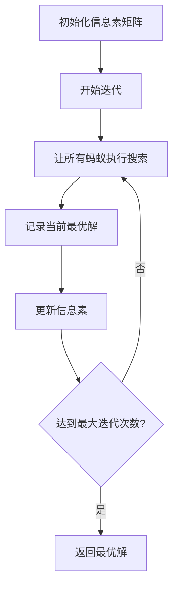
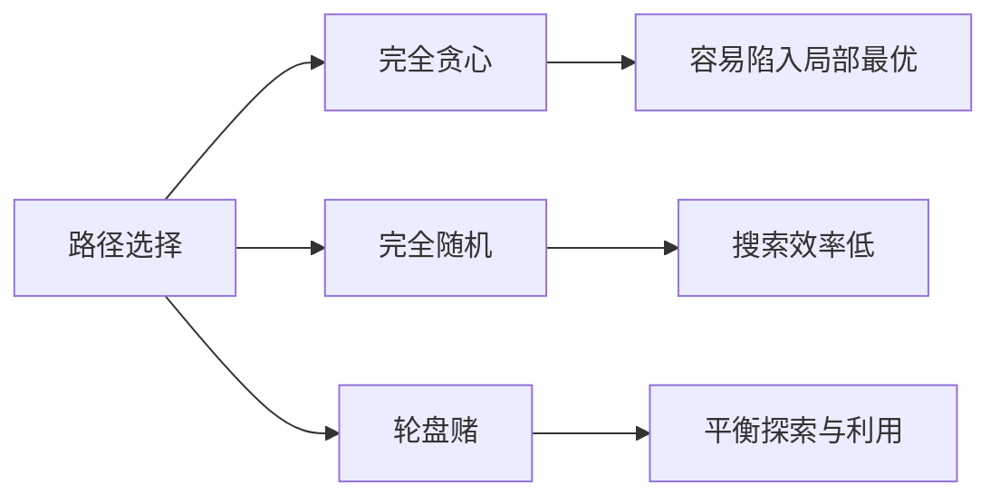
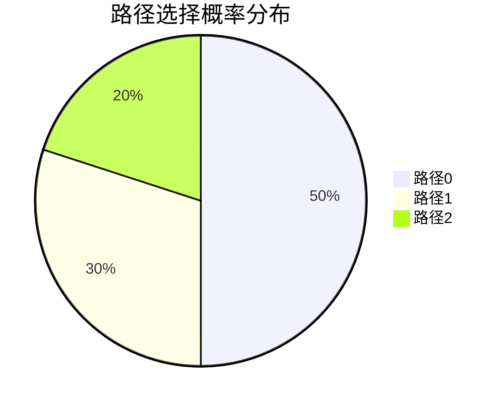
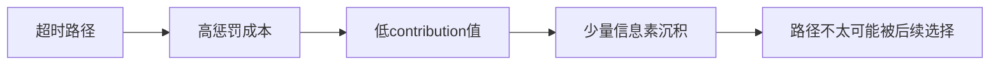
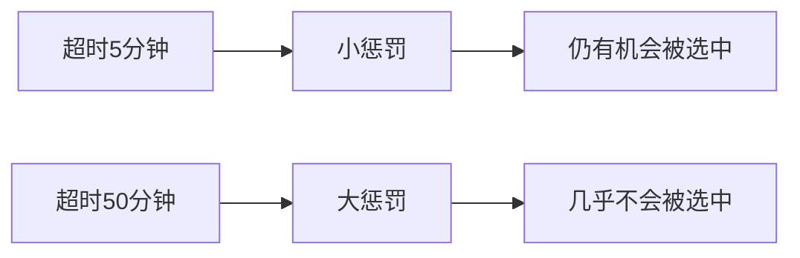
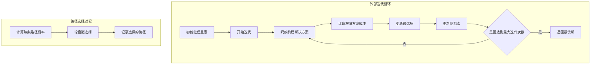

# 蚁群算法 (ACO) 详细解析

## 1. 算法概述

蚁群算法模拟了蚂蚁在寻找食物过程中的集体行为。在我们的实现中，每只蚂蚁都试图为每个顾客选择一条合适的配送路径。



## 2. 核心参数

```java:src/main/java/algorithm/AntColony.java
public class AntColony implements OptimizationAlgorithm {
    private final int antCount;           // 蚂蚁数量
    private final double pheromoneWeight; // 信息素权重 (α)
    private final double evaporationRate; // 信息素蒸发率 (ρ)
    private final int maxIterations = 1000; // 最大迭代次数
}
```

## 3. 关键公式

### 路径选择概率公式

对于顾客i的第j条路径，选择概率为：

$$
P_{ij} = \frac{[\tau_{ij}]^\alpha \cdot [\eta_{ij}]^\beta}{\sum_{k=1}^{m} [\tau_{ik}]^\alpha \cdot [\eta_{ik}]^\beta}

其中：
$$

- $$
  \tau_{ij}是信息素浓度
  $$

  $$
  \eta_{ij} 是启发式信息 = \frac{1}{distance + cost}
  $$

  
- $$
  \alpha 是信息素权重
  $$

  
- $$
  \beta 是启发式因子（在我们的实现中为1）
  $$

  
- $$
  m 是可选路径数量
  $$

  

#### 路径选择实现

```
private Solution constructSolution(Problem problem, double[][] pheromones) {
    Solution solution = new Solution();
    
    for (int i = 0; i < problem.getCustomers().size(); i++) {
        // 计算每条路径的选择概率
        double[] probabilities = calculateProbabilities(i, problem, pheromones);
        // 使用轮盘赌选择路径
        int selectedPath = rouletteWheelSelection(probabilities);
        solution.setPathIndex(i, selectedPath);
    }
    
    return solution;
}
```

轮盘赌在蚁群算法中用于基于概率选择路径。让我详细解释其实现和原因：

#### 为什么使用轮盘赌？

1. **概率选择的需求**


2. **探索与利用的平衡**
- 高信息素的路径有更大概率被选中（利用）
- 低信息素的路径仍有机会被选中（探索）

#### 轮盘赌的实现

```java:src/main/java/algorithm/AntColony.java
private Solution constructSolution(Problem problem, double[][] pheromones) {
    Solution solution = new Solution();
    
    for (int i = 0; i < problem.getCustomers().size(); i++) {
        int pathCount = problem.getPaths().get("customer_" + i).size();
        double[] probabilities = new double[pathCount];
        double total = 0;
        
        // 1. 计算每条路径的选择权重
        for (int j = 0; j < pathCount; j++) {
            Path path = problem.getPaths().get("customer_" + i).get(j);
            double heuristic = 1.0 / (path.getDistance() + path.getCost());
            // 信息素浓度和启发式信息的组合
            probabilities[j] = Math.pow(pheromones[i][j], pheromoneWeight) * heuristic;
            total += probabilities[j];
        }
        
        // 2. 轮盘赌选择
        double r = random.nextDouble() * total;  // 生成随机数
        double sum = 0;
        for (int j = 0; j < pathCount; j++) {
            sum += probabilities[j];
            if (sum >= r) {  // 找到第一个累积和超过随机数的选项
                solution.setPathIndex(i, j);
                break;
            }
        }
    }
    return solution;
}
```

#### 具体示例

假设有3条路径，权重分别是：
```
路径0：权重 = 0.5 (信息素高)
路径1：权重 = 0.3 (信息素中等)
路径2：权重 = 0.2 (信息素低)

总权重 = 1.0
```

选择过程：
```java
// 1. 生成随机数 r ∈ [0,1)
double r = 0.7;  // 假设生成了0.7

// 2. 累积概率比较
sum = 0.0 + 0.5 = 0.5  // 路径0：0.7 > 0.5，继续
sum = 0.5 + 0.3 = 0.8  // 路径1：0.7 < 0.8，选中！
// 路径2不需要检查了
```




### 信息素更新公式

$$
\tau_{ij}(t+1) = (1-\rho)\tau_{ij}(t) + \Delta\tau_{ij}
$$

其中：
- $$
  \rho 是蒸发率
  $$

  
- $$
  \Delta\tau_{ij} 是信息素增量 = \sum\frac{Q}{L_k}
  $$

  
- $$
  Q 是常数（在我们的实现中为1）
  $$

  
- $$
  L_k 是蚂蚁k找到的解的总成本,L_K = calculateCost(cost,distance,totalTime)
  $$

  

#### 信息素更新的实现：

1. **计算成本 (calculateCost)**
```java:src/main/java/algorithm/AntColony.java
private double calculateCost(Solution solution, Problem problem) {
    double totalCost = 0;
    double totalTime = 0;
    
    // 1. 计算基础成本和时间
    for (int i = 0; i < solution.getPathIndices().length; i++) {
        Path path = problem.getPaths().get("customer_" + i).get(solution.getPathIndices()[i]);
        totalCost += path.getDistance() + path.getCost();  // 基础成本 = 距离 + 成本
        totalTime += path.getTime();                       // 累计时间
    }
    
    // 2. 如果超时，添加惩罚成本
    if (totalTime > problem.getTimeConstraint()) {
        totalCost += (totalTime - problem.getTimeConstraint()) * 1000;  // 惩罚因子为1000
    }
    
    return totalCost;  // 返回总成本（包括可能的时间惩罚）
}
```

2. **信息素更新**
```java:src/main/java/algorithm/AntColony.java
private void updatePheromones(double[][] pheromones, List<Solution> solutions, Problem problem) {
    // 1. 信息素蒸发
    for (int i = 0; i < pheromones.length; i++) {
        for (int j = 0; j < pheromones[i].length; j++) {
            pheromones[i][j] *= (1 - evaporationRate);
        }
    }
    
    // 2. 信息素沉积
    for (Solution solution : solutions) {
        // contribution越小，说明成本越高（包括时间惩罚）
        double contribution = 1.0 / calculateCost(solution, problem);
        
        // 为解决方案使用的每条路径增加信息素
        for (int i = 0; i < solution.getPathIndices().length; i++) {
            pheromones[i][solution.getPathIndices()[i]] += contribution;
        }
    }
}
```

关键点在于：

1. **间接关联**：
   - 时间约束通过 `calculateCost` 影响总成本
   - 总成本反过来决定信息素增加量（contribution）

2. **惩罚机制**：


3. **数值示例**：
   - 假设有两个解决方案：
     ```
     方案A：总成本=100（未超时）
     contribution_A = 1/100 = 0.01
     
     方案B：总成本=1100（超时，包含1000的惩罚）
     contribution_B = 1/1100 ≈ 0.0009
     ```
   - 方案A会留下更多信息素（0.01 > 0.0009）
   - 这使得未来的蚂蚁更倾向于选择不超时的路径

这样，虽然时间约束没有直接参与信息素更新公式，但通过成本计算间接影响了信息素的分布，引导算法避开超时的路径。


#### 选择惩罚机制而不是直接淘汰的主要原因

1. **保持搜索空间的连续性**
```java:src/main/java/algorithm/AntColony.java
private double calculateCost(Solution solution, Problem problem) {
    // 使用惩罚而不是直接返回无穷大或淘汰
    if (totalTime > problem.getTimeConstraint()) {
        totalCost += (totalTime - problem.getTimeConstraint()) * 1000;
    }
}
```

2. **区分不同程度的超时**


3. **避免局部最优**
```java:src/main/java/algorithm/AntColony.java
private void updatePheromones(double[][] pheromones, List<Solution> solutions, Problem problem) {
    // 即使是超时解决方案也会留下一些信息素
    // 这有助于算法跳出局部最优
    double contribution = 1.0 / calculateCost(solution, problem);
    // ...
}
```

举个例子：
```
情况A（当前实现）：
- 解决方案1：时间=125分钟（超时5分钟），成本=100
  最终成本 = 100 + (5 * 1000) = 5100
  信息素贡献 = 1/5100 ≈ 0.0002

- 解决方案2：时间=150分钟（超时30分钟），成本=80
  最终成本 = 80 + (30 * 1000) = 30080
  信息素贡献 = 1/30080 ≈ 0.00003

情况B（如果直接淘汰）：
- 解决方案1：直接淘汰
- 解决方案2：直接淘汰
```

优点：
1. **渐进式优化**：允许算法通过轻微超时的解逐步找到可行解
2. **信息保留**：超时解可能包含有用的部分路径组合
3. **灵活性**：可以通过调整惩罚因子来控制对超时的容忍度
4. **搜索多样性**：保持更多的探索可能性

如果直接淘汰：
1. 可能错过潜在的好解
2. 在初期可能难以找到任何可行解
3. 算法容易陷入局部最优
4. 失去了解决方案之间的梯度信息


## 4. 核心代码实现

### 主要求解流程
```java:src/main/java/algorithm/AntColony.java
public Solution solve(Problem problem) {
    double[][] pheromones = initializePheromones(problem);
    Solution bestSolution = null;
    double bestCost = Double.MAX_VALUE;

    for (int iteration = 0; iteration < maxIterations; iteration++) {
        List<Solution> antSolutions = new ArrayList<>();
        
        // 每只蚂蚁构建解
        for (int ant = 0; ant < antCount; ant++) {
            Solution solution = constructSolution(problem, pheromones);
            antSolutions.add(solution);
            
            double cost = calculateCost(solution, problem);
            if (cost < bestCost) {
                bestCost = cost;
                bestSolution = solution.clone();
            }
        }
        
        updatePheromones(pheromones, antSolutions, problem);
    }
    return bestSolution;
}
```


## 5. 算法流程图



