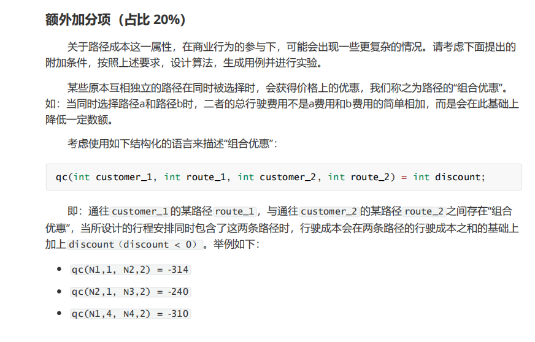

# 额外加分项-考虑组合优惠问题

## 问题定义




在外卖配送系统中，存在多个餐厅作为取餐点，订单动态到达系统后需要司机接单并进行配送。配送过程中会产生距离成本。配送特征如下：
- 一次配送服务需要满足n个顾客。
- 每个顾客有m条可选配送路径。
- 路径包含三个属性：距离、费用、时间。

目标是优化配送路径，使得总成本最低，同时满足以下约束条件：
- 总配送时间不超过预设时限C。

## 模拟退火解法

### 解题思路
模拟退火算法（Simulated Annealing）是一种启发式搜索算法，用于寻找问题的近似最优解。该算法通过模拟金属退火过程来逐步逼近最优解：
1. **初始化**：设置初始温度、冷却速率和终止温度。
2. **生成初始解**：随机为每个顾客选择一条路径作为初始解。
3. **迭代搜索**：
   - 生成邻域解：随机改变一个顾客的路径。
   - 计算能量函数：评估当前解的总成本和总时间。
   - 接受概率判断：根据能量差和当前温度决定是否接受新解。
   - 降温过程：按照冷却速率降低温度。
4. **结束条件**：当温度降至终止温度时，算法结束。

### 代码框架

#### SimulatedAnnealing.java
```java
// 定义模拟退火类
public class SimulatedAnnealing {
    // 类成员变量定义...
}

// 构造函数，初始化参数
public SimulatedAnnealing() {
    // 初始化代码...
}

// 解决问题的主体方法
public int[] solve() {
    // 迭代搜索代码...
    return bestSolution;
}

// 生成随机初始解
private int[] generateRandomSolution() {
    // 随机解生成代码...
}

// 生成新的邻域解
private int[] generateNewSolution(int[] solution) {
    // 邻域解生成代码...
}

// 计算总成本
private double calculateTotalCost(int[] solution) {
    // 成本计算代码...
}
```

#### TestDataSet.java

``` java
// 定义测试数据集类
public class TestDataSet {
    // 类成员变量定义...
}

// 构造函数，生成测试数据
public TestDataSet() {
    generateTestData();
}

// 生成测试数据的方法
private void generateTestData() {
    // 测试数据生成代码...
}

// 公共方法，用于访问路径属性和组合优惠
public int getDistance(int customer, int path) {
    return distances[customer][path];
}

public int getCost(int customer, int path) {
    return costs[customer][path];
}

public int getTime(int customer, int path) {
    return times[customer][path];
}

public int getDiscount(int customer1, int path1, int customer2, int path2) {
    return discounts[customer1][customer2][path1][path2];
}
```

### 运行结果


可以看到，最终算法选择的路径的总时间低于限制时间，且达到了客户1路径2&客户2路径3、客户3路径3&客户5路径1这两个最大的组合优惠，算法效果优良

##  遗传算法解法

### 算法流程：

~~~java
private static final int POPULATION_SIZE = 50; // 种群规模
private static final int GENERATIONS = 200; // 最大代数
private static final double MUTATION_RATE = 0.1; // 变异率
private static final double CROSSOVER_RATE = 0.8; // 交叉率
~~~

`POPULATION_SIZE` 定义了种群中个体数量。

`GENERATIONS` 表示迭代次数。

`MUTATION_RATE` 是变异概率。

`CROSSOVER_RATE` 是交叉概率。

#### 遗传主循环

~~~java
for (int generation = 0; generation < GENERATIONS; generation++) {
~~~

进行 `GENERATIONS` 次迭代，每次迭代模拟一代

#### 选择和生成新一代

使用锦标赛选择方法 (select) 选择父代。
按概率决定是否执行交叉 (crossover)，生成两个子代，否则直接保留父代。
新个体添加到新种群 newPopulation 中。

~~~java
while (newPopulation.size() < POPULATION_SIZE) {
    int[] parent1 = select(population);
    int[] parent2 = select(population);
    if (Math.random() < CROSSOVER_RATE) {
        int[][] offspring = crossover(parent1, parent2);
        newPopulation.add(offspring[0]);
        newPopulation.add(offspring[1]);
    } else {
        newPopulation.add(parent1);
        newPopulation.add(parent2);
    }
}
~~~

#### 变异

按概率对每个个体执行变异操作。

~~~java
for (int[] individual : newPopulation) {
    if (Math.random() < MUTATION_RATE) {
        mutate(individual);
    }
}
~~~

#### 评估适应度并更新最优解

遍历种群，计算每个个体的适应度，如果当前个体优于之前的最优解，更新最优解。

~~~java
for (int[] individual : population) {
    double fitness = calculateFitness(individual);
    if (fitness < bestFitness) {
        bestFitness = fitness;
        bestSolution = individual.clone();
    }
}
~~~

### 具体函数解释

种群初始化：`initializePopulation()`

随机生成种群中的每个个体，个体用整数数组表示，每个元素表示一个客户选择的路径索引。

~~~java
private List<int[]> initializePopulation() {
    List<int[]> population = new ArrayList<>();
    for (int i = 0; i < POPULATION_SIZE; i++) {
        int[] individual = new int[TestDataSet.CUSTOMERS];
        for (int j = 0; j < TestDataSet.CUSTOMERS; j++) {
            individual[j] = (int) (Math.random() * TestDataSet.PATHS_PER_CUSTOMER);
        }
        population.add(individual);
    }
    return population;
}
~~~

适应度函数：`calculateFitness()`
计算个体的总成本，包括路径费用、超时惩罚和折扣优惠。

~~~java
private double calculateFitness(int[] individual) {
    int totalCost = 0;
    int totalTime = 0;

    for (int i = 0; i < individual.length; i++) {
        int path = individual[i];
        totalCost += testDataSet.getCost(i, path);
        totalTime += testDataSet.getTime(i, path);
    }

    if (totalTime > TestDataSet.TIME_LIMIT) {
        totalCost += (totalTime - TestDataSet.TIME_LIMIT) * TestDataSet.EXTRA_TIME_COST;
    }

    for (int i = 0; i < individual.length; i++) {
        for (int j = i + 1; j < individual.length; j++) {
            int discount = testDataSet.getDiscount(i, individual[i], j, individual[j]);
            totalCost += discount;
        }
    }

    return totalCost; // 适应度值越小越好
}
~~~

选择操作：`select()`
通过锦标赛选择法挑选种群中的优秀个体。

~~~java
private int[] select(List<int[]> population) {
    int tournamentSize = 5;
    int[] bestIndividual = null;
    double bestFitness = Double.MAX_VALUE;

    for (int i = 0; i < tournamentSize; i++) {
        int[] individual = population.get((int) (Math.random() * population.size()));
        double fitness = calculateFitness(individual);
        if (fitness < bestFitness) {
            bestFitness = fitness;
            bestIndividual = individual;
        }
    }

    return bestIndividual.clone();
}
~~~

交叉操作：`crossover()`
实现单点交叉，生成两个子代。随机选择交叉点，交换父代在交叉点之前和之后的部分。

~~~java
private int[][] crossover(int[] parent1, int[] parent2) {
    int crossoverPoint = (int) (Math.random() * parent1.length);
    int[] offspring1 = new int[parent1.length];
    int[] offspring2 = new int[parent2.length];

    for (int i = 0; i < parent1.length; i++) {
        if (i < crossoverPoint) {
            offspring1[i] = parent1[i];
            offspring2[i] = parent2[i];
        } else {
            offspring1[i] = parent2[i];
            offspring2[i] = parent1[i];
        }
    }

    return new int[][] { offspring1, offspring2 };
}
~~~

变异操作：`mutate()`
随机选择一个基因（路径），修改为一个随机路径索引。

~~~java
private void mutate(int[] individual) {
    int index = (int) (Math.random() * individual.length);
    individual[index] = (int) (Math.random() * TestDataSet.PATHS_PER_CUSTOMER);
}
~~~