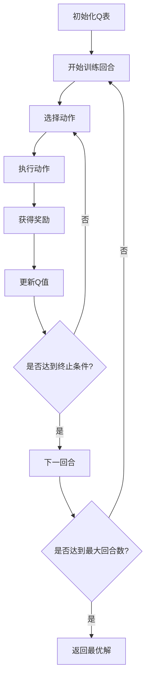
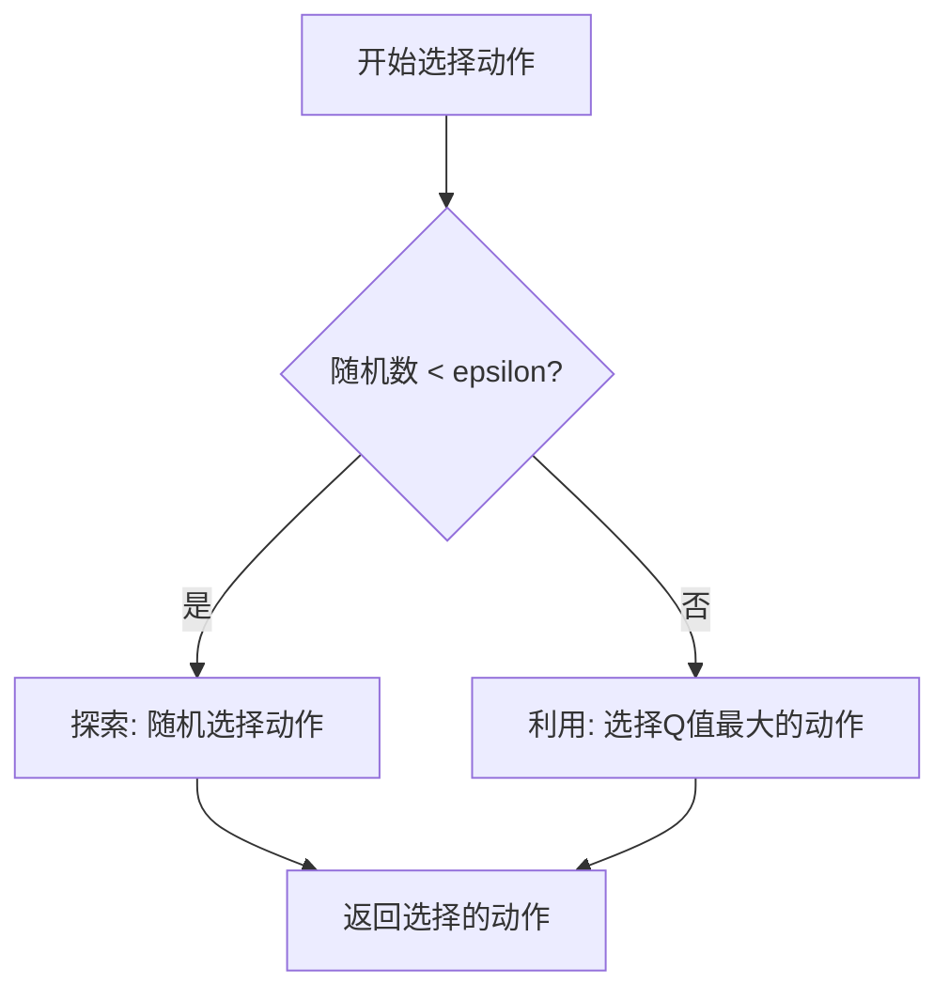
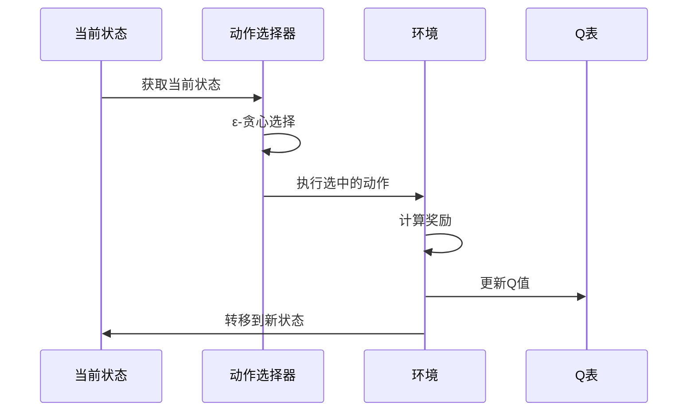

# 强化学习策略方案

让我详细解析这个强化学习 (Reinforcement Learning, RL) 算法的实现：

### 1. 核心参数

```java:src/main/java/algorithm/ReinforcementLearning.java
public class ReinforcementLearning implements OptimizationAlgorithm {
    private final int episodes;           // 训练回合数
    private final double learningRate;    // 学习率 (α)
    private final double discountFactor;  // 折扣因子 (γ)
    private final double epsilon;         // 探索率 (ε)
    private Map<String, double[]> qTable; // Q值表
}
```

### 2. 算法流程



### 3. 关键公式

1. **Q值更新公式**：

   $$
   Q(s,a) = Q(s,a) + α[R + γ\max_{a'}Q(s',a') - Q(s,a)]
   $$
   其中：
   
   - $$
     Q(s,a)是状态s下采取动作a的价值
     $$
   
     
   - $$
     α 是学习率
     $$
   
     
   - $$
     R 是即时奖励
     $$
   
     
   - $$
     γ 是折扣因子
     $$
   
     
   - $$
     \max_{a'}Q(s',a') 是下一状态的最大Q值
     $$
   
     
2. **ε-贪心策略**：

   ```java:src/main/java/algorithm/ReinforcementLearning.java
   private int selectAction(String state, int actionCount) {
       if (random.nextDouble() < epsilon) {  // 探索
           return random.nextInt(actionCount);
       }
       // 利用：选择Q值最大的动作
       double[] qValues = qTable.get(state);
       return maxQValueIndex(qValues);
   }
   ```

### 4. 核心实现

1. **训练过程**

```java:src/main/java/algorithm/ReinforcementLearning.java
public Solution solve(Problem problem) {
    initializeQTable(problem);
    Solution bestSolution = generateInitialSolution(problem);
    double bestReward = calculateReward(bestSolution, problem);
  
    // 训练阶段
    for (int episode = 0; episode < episodes; episode++) {
        Solution solution = runEpisode(problem);
        double reward = calculateReward(solution, problem);
    
        if (reward > bestReward) {
            bestReward = reward;
            bestSolution = solution.clone();
        }
    
        // 如果找到可行解就提前结束
        if (solution.getTotalTime() <= problem.getTimeConstraint()) {
            bestSolution = solution.clone();
            break;
        }
    }
    return bestSolution;
}
```

2. **单次回合执行**

```java:src/main/java/algorithm/ReinforcementLearning.java
private Solution runEpisode(Problem problem) {
    Solution solution = new Solution(problem.getCustomers().size());
    double currentTime = 0.0;
  
    for (int customerIndex = 0; customerIndex < problem.getCustomers().size(); customerIndex++) {
        String state = getState(customerIndex);
        int action = selectAction(state, problem.getPaths().get("customer_" + customerIndex).size());
    
        // 执行动作
        solution.setPathIndex(customerIndex, action);
        Path path = problem.getPaths().get("customer_" + customerIndex).get(action);
        currentTime += path.getTime();
    
        // 更新Q值
        double reward = calculateStepReward(path, currentTime, problem.getTimeConstraint());
        String nextState = getState(customerIndex + 1);
    
        if (qTable.containsKey(nextState)) {
            double maxNextQ = Arrays.stream(qTable.get(nextState)).max().orElse(0.0);
            double oldQ = qTable.get(state)[action];
            double newQ = oldQ + learningRate * (reward + discountFactor * maxNextQ - oldQ);
            qTable.get(state)[action] = newQ;
        }
    }
    return solution;
}
```

3. **奖励计算**

```java:src/main/java/algorithm/ReinforcementLearning.java
private double calculateStepReward(Path path, double currentTime, double timeConstraint) {
    double reward = -(path.getDistance() + path.getCost());  // 基础奖励为负的成本
    if (currentTime > timeConstraint) {
        reward -= (currentTime - timeConstraint) * 100;  // 超时惩罚
    }
    return reward;
}
```

### 5. 特点分析

1. **状态表示**

   - 使用顾客索引作为状态
   - 简化了状态空间，但可能损失一些信息
2. **动作空间**

   - 每个顾客的可选路径构成动作空间
   - 动作数量固定，便于Q表存储
3. **探索与利用**

   - 使用ε-贪心策略平衡探索和利用
   - epsilon控制探索概率
4. **奖励设计**

   - 即时奖励：路径成本的负值
   - 延迟奖励：通过折扣因子传播
   - 超时惩罚：确保时间约束

### 6. 优化策略

1. **初始解生成**

```java:src/main/java/algorithm/ReinforcementLearning.java
private Solution generateInitialSolution(Problem problem) {
    // 使用贪心策略生成初始解
    // 选择每个顾客的最短时间路径
}
```

2. **贪心解兜底**

```java:src/main/java/algorithm/ReinforcementLearning.java
if (bestSolution.getTotalTime() > problem.getTimeConstraint()) {
    Solution greedySolution = generateGreedySolution(problem);
    if (greedySolution.getTotalTime() <= problem.getTimeConstraint()) {
        bestSolution = greedySolution;
    }
}
```

这个RL实现结合了Q-learning的理论框架和问题特定的优化策略，通过反复试错来学习最优的路径选择策略。


## 如何选择action

在RL算法中，动作选择使用了ε-贪心策略（Epsilon-Greedy）。让我详细解释这个过程：

### 1. 动作选择的核心代码

```java:src/main/java/algorithm/ReinforcementLearning.java
private int selectAction(String state, int actionCount) {
    // 探索：以 epsilon 的概率随机选择
    if (random.nextDouble() < epsilon) {
        return random.nextInt(actionCount);
    }
  
    // 利用：选择Q值最大的动作
    double[] qValues = qTable.get(state);
    return maxQValueIndex(qValues);
}

// 找出Q值最大的动作索引
private int maxQValueIndex(double[] qValues) {
    int maxIndex = 0;
    double maxValue = qValues[0];
  
    for (int i = 1; i < qValues.length; i++) {
        if (qValues[i] > maxValue) {
            maxValue = qValues[i];
            maxIndex = i;
        }
    }
    return maxIndex;
}
```

### 2. 选择过程图解



### 完整的选择-更新循环



## Q表格示例

### Q表格 (Q-Table)

| 顾客\路径  | path_0 | path_1 | path_2 | path_3 |
| ---------- | ------ | ------ | ------ | ------ |
| customer_0 | 12.5   | 8.7    | 15.2   | 10.1   |
| customer_1 | 9.8    | 14.3   | 7.6    | 11.9   |
| customer_2 | 13.4   | 10.8   | 9.2    | 12.7   |

- 每行代表一个顾客的状态
- 每列代表一个可能的路径选择（动作）
- 单元格中的数值是对应的Q值

例如：
- customer_0的最优选择是path_2 (Q值=15.2)
- customer_1的最优选择是path_1 (Q值=14.3)
- customer_2的最优选择是path_0 (Q值=13.4)

这种表示方法更清晰地展示了状态-动作空间中的Q值分布。在代码中，这个Q表就是通过Map<String, double[]>来实现的。
